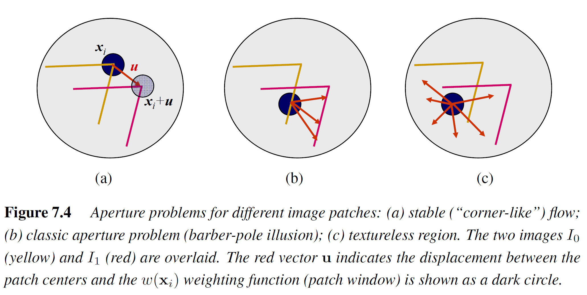
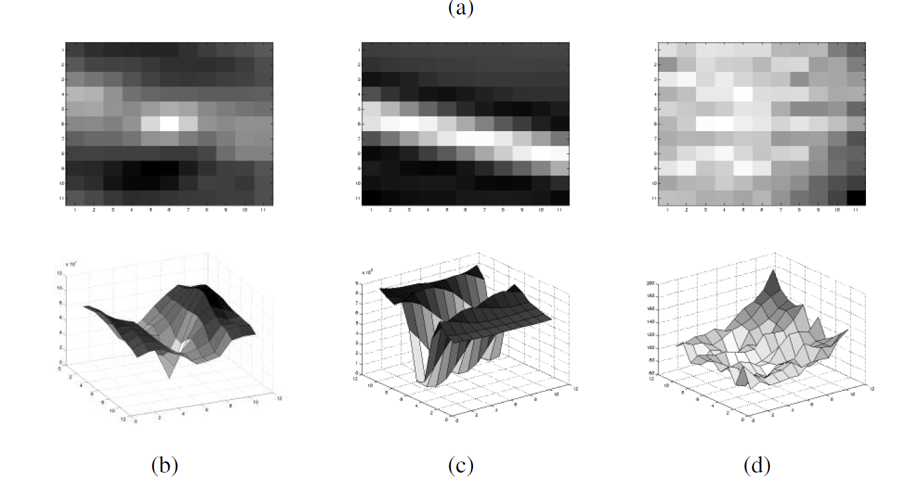
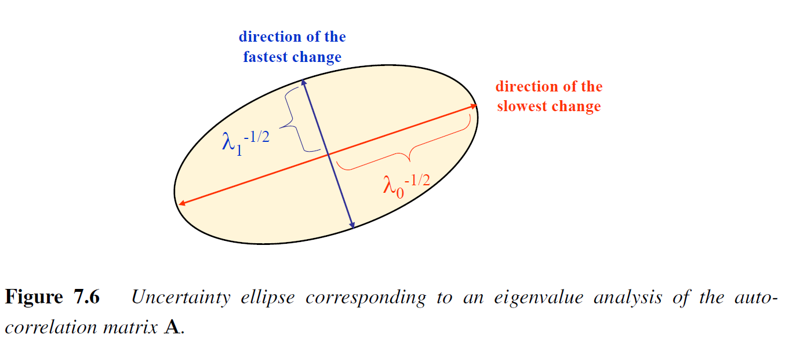
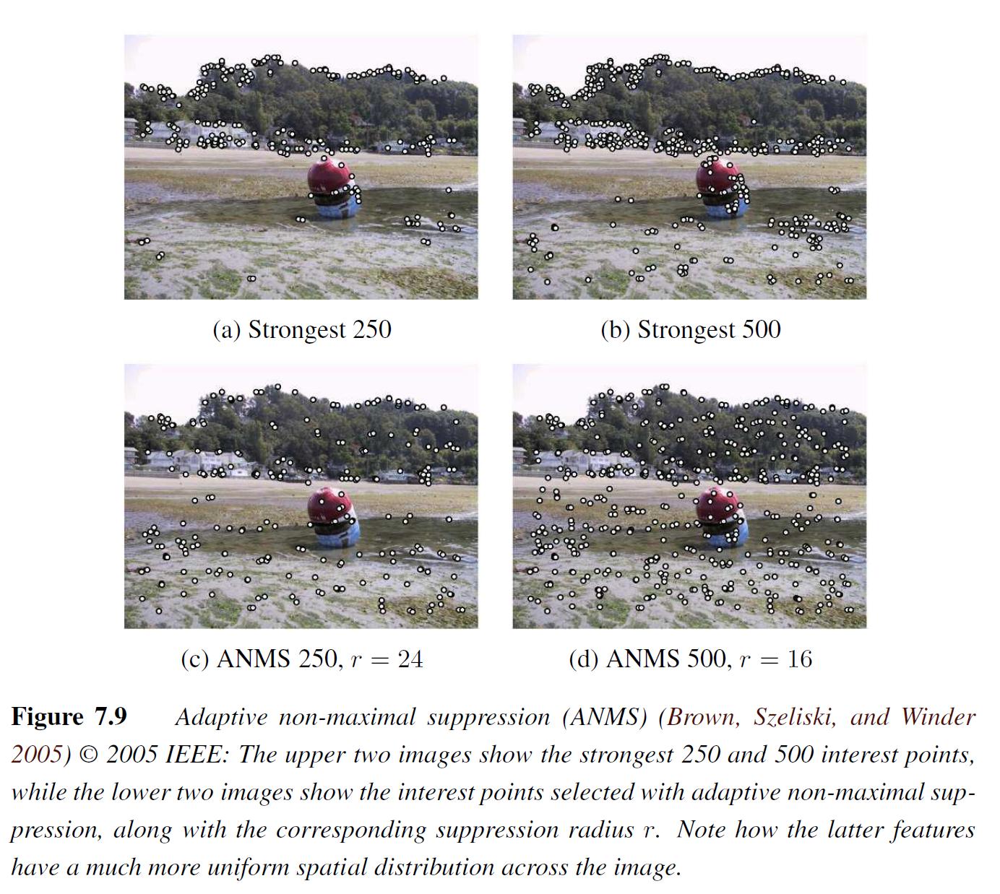

# Computer Vision Algorithms and Applications

## Feature Detection and matching
There can be different types of features:
1. point like
2. texture like
3. contour like

### Points and Patches
There are 4 stages:
1. Feature Detection
2. Feature Descriptor
3. Feature Matching
4. Feature Tracking - it is alternative to matching - used when small motion

#### Feature Detection
> How can we find image locations where we can reliably find correspondences with other images, i.e., what are good features to track

* Point is located in a textureless region - Not stable because it can be matched to any textureless point
* Point is located on an edge high contrast changes in one direction - Not stable because it can be matched to multiple points from another edge - aperture problem
* Point on corner - stable because it can be matched only on a specific corner point

An example bellow:

<figure id="fig:good_features_to_track">
    
    <figcaption>Good Features to Track</figcaption>
</figure>

The intuition from above can be written as:
$$E_{\text{WSSD}}\left(\bold{u}\right) = \Sigma_{i}w\left(x_i\right)\left[I_1\left(x_i + \bold{u}\right) - I_0\left(x_i\right)\right]^2$$

Where $I_0$ and $I_1$ are the two image being compared, $\bold{u} = \left(u, v\right)$ being the displacement vector, and $w\left(x\right)$ weighting function.

When performing feature detection, there is only one image, not two. So, instead of comparing two images, we must compare the image against itself - this is known as *aut-correlation*:
$$E_{AC}\left(\triangle\bold{u}\right)= \Sigma_{i}w\left(x_i\right)\left[I_0\left(x_i + \bold{u}\right) - I_0\left(x_i\right)\right]^2$$

Using Taylor Series the equation get reduced to $\triangle\bold{u}^{T}\bold{A}\triangle\bold{u}$, where $\triangle I_0\left(x_i\right) = \left(\frac{\delta I_0}{\delta x}, \frac{\delta I_0}{\delta y}\right)\left(x_i\right)$

The auto-correlation matrix A can be written as 
$$A = w \star 
\left[\begin{matrix}
    I_x^2 & I_xI_y\\
    I_xI_y & I_y^2
\end{matrix} \right]
$$

This can be interpreted as an image with a pixel having the estimation of the auto-correlation function.

<figure id="fig:auto_corr_surfaces">
    
    <figcaption>Auto Correlation Surfaces</figcaption>
</figure>

<figure id="fig:corr_ellipse">
    
    <figcaption>Correlation Ellipse</figcaption>
</figure>

Using eigen analysis of the $A$ we can find good features to track - both eigen values should be large enough

* $\text{det}\left(\bold{A}\right) = \alpha \text{ trace} \left(\bold{A}\right)^2 = \lambda_0 \lambda_1 - \alpha \left(\lambda_0 + \lambda_1\right)^2$

##### Adaptive non-maximal suppression (ANMS).

Instead of having multiple features concentrated in one place, it is better to have them uniformly spread all over the image

<figure id="fig:anms">
    
    <figcaption>Adaptive Non-Maximum Suppression</figcaption>
</figure>

###### Measuring Repeatability 
The frequency by which features from one images can be found in an another image
1. Scale invariance - the detected features should be robust when it comes to different scales
2. Rotation invariance 
3. Affine invariance - Invariant under affine transformation

###### Example of Feature detectors
* SURF - uses integral images for faster convolutions
* FAST and FASTER - first learned detectors
* BRISK - uses a scale-space FAST detector together with a bit-string descriptor
* KAZE and ACCELERATED-KAZE - non-linear diffusion to select the scale for feature detection
* deep convolution neural networks feature detection
  * Learning covariant feature detectors
  * Learning to assign orientations to feature points
  * LIFT, learned invariant feature transforms
  * AffNet
  * KeyNet
  * D2-Net - R2D2 - D2D: dense feature descriptors

  The keypoints are not the only features that can be used for registering images - lines and segments can also be used

#### Feature Descriptors

Once we have keypoint features, we would like to match them in order to match them across different viewpoints. Because the patches around the keypoint may undergo a rotational, scalable or affine transformation, comparing the patches naively will results in poor matches. Instead of taking a patch as a descriptor, there are different techniques that are invariant (to some degree) to scale, rotation, and some to affine transform.

* Bias and gain normalization
* Scale invariant feature transform (**SIFT**)
  1. compute the gradient at each pixel in a $16 \times 16 $ window around the keypoint
  2. at each $4 \times 4$ quadrant, a gradient orientation histogram is formed of 8 bin
  3. each of the original 256 weighted gradient magnitudes is softly added into $2 \times 2 \times 2$ adjacent histogram bins in the $\left(x, y, \theta\right)$ space using trilinear interpolation
  4. 128-D (16 quadrants in $16 \times 16$ window, each having 8-bit histogram) vector is normalized
    1. to further make the descriptor more robust, values are clipped to 0.2 and normalized again

* **PCA-SIFT**
  * Bigger sift descriptor
  * use PCA for dimensionality reduction
* **RootSIFT**
    > simply re-normalizing SIFT descriptors using an L1 measure and then taking the square root of each component, a dramatic increase in performance (discriminability) can be obtained.
* Gradient location-orientation histogram (**GLOH**).
  * variant of SIFT 
  * uses a log-polar binning structure instead of the four quadrants used
  * uses 16 orientation bins instead of 8
  * outperforms SIFT by a small margin
* Steerable filters
*  **BRIEF** 
  * randomly selected points
  * create 128 bit string
  * used with hamming distance
  * performant
* **ORB** 
  * add orientation to FAST detector before computing BRIEF descriptor
* **BRISK**
  * add scale-space analysis to FAST
  
Since 2015 os so, most og the new feature descriptor are constructed using deep learning -  
1. [HPatches: A benchmark and evaluation of handcrafted and learned local descriptors](https://arxiv.org/pdf/1704.05939). 
2. [Image Matching Across Wide Baselines: From Paper to Practice](https://arxiv.org/pdf/2003.01587)

Besides sparse keypoint detectors and descriptors, there is a dense approach - both images are used as inputs, the results being a dense keypoint map.

> Theoretically, these CNN models can learn receptive fields that use all of the pixels in the image, although in practice they tend to use Gaussian-like receptive fields.

#### Feature Matching

