<style>
    /* initialise the counter */
    body { counter-reset: figureCounter; }
    /* increment the counter for every instance of a figure even if it doesn't have a caption */
    figure { counter-increment: figureCounter; }
    /* prepend the counter to the figcaption content */
    figure figcaption:before {
        content: "Figure " counter(figureCounter) ": "
    }

    summary {
        color: yellow;
    }
</style>

# Introduction to Information Retrieval

## Boolean Retrieval

### Incidence Matrix
Each term (word) is represented as a vector of ones and zeros - one if the term can be found in a given document, 0 otherwise. Example in [Figure](#fig:incidence_matrix)

If, for example, we are searching for documents which contain Brutus and Caesar, the query would be stated as a bitwise and on the zero-one vector of Brutus and Caesar.
<figure id="fig:incidence_matrix">
    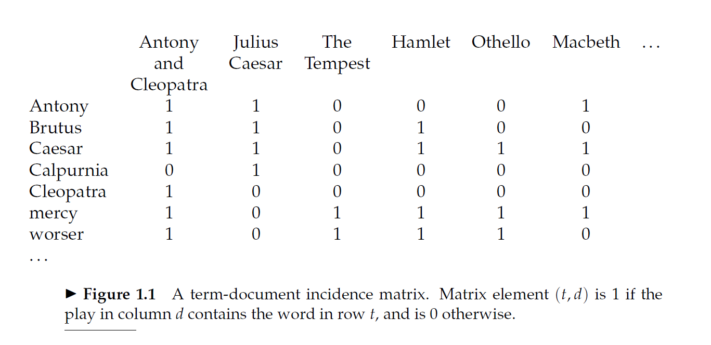
    <figcaption>Incidence Matrix</figcaption>
</figure>

Of course, if this matrix would be stored naively, the memory footprint is huge. Luckily, the matrix is sparse - there way less ones than zeros - and this gives the opportunity to store the matrix as an array, where each word has an index. For each array slot, there is a list which contains the document id where the actual word can be found. Besides the document id, there can be stored different types of metadata - how many times the term is encountered in a specific doc, etc.

### Inverted Index
As previously stated, storing the incident matrix would result in a huge memory footprint. Having a sparse structure, the indexes can be stored as list of documents where a specific term can be found. an example can be found in [Figure](#fig:inverted_index)

<figure id="fig:inverted_index">
    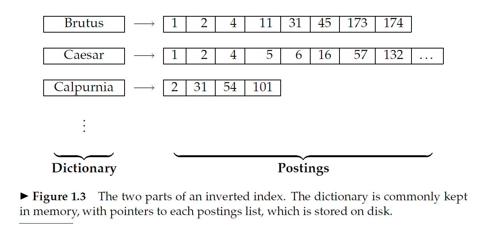
    <figcaption>Inverted indexing</figcaption>
</figure>

How to build an inverted index [Figure](#fig:build_inverted_index):
1. Collect the documents to be indexed
2. Tokenize the text
3. Do a linguistic preprocessing - normalize tokens
4. Index the documents, creating the inverted index - as in [Figure](#fig:inverted_index) - consisting of dictionary and postings lists


<figure id="fig:build_inverted_index">
    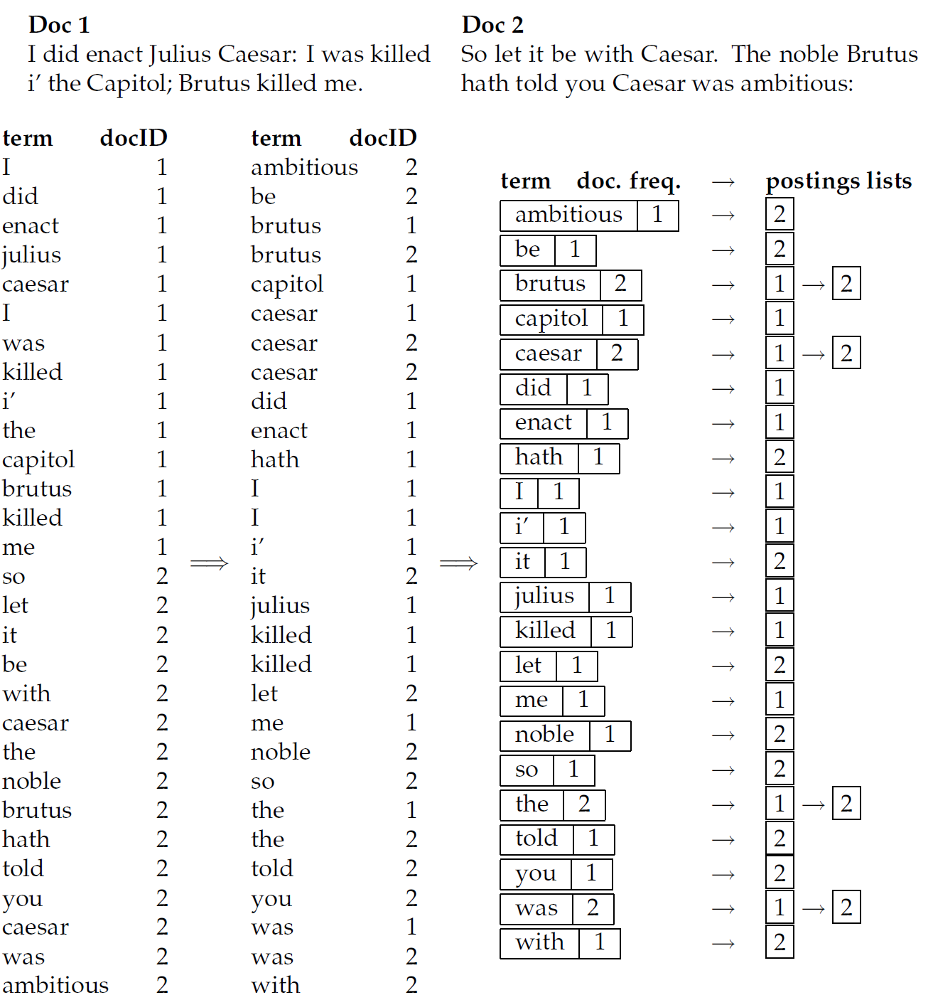
    <figcaption>Building Inverted indexing</figcaption>
</figure>

The term dictionary is sorted, the same happens for posting list. This approach helps with access performance. Besides $\text{docId}$, the dictionary can records some statistics - such as document frequency - and other metadata, if needed.

#### Memory footprint
In terms of memory, this type of indexing pays for the dictionary and the postings lists. The footprint of the postings lists is much larger than the footprint of the dictionary. Some data structures come into mind
1. **Fixed Length Arrays**: Some words occur in more documents than other words. It could be wasteful
2. **Linked Lists**: 
   * **Pros**
     * Doesn't have to be fixed
     * Fast insert
   * **Cons**
     * extra storage for pointers
3. **Dynamic Arrays**: 
   * No pointer overhead 
   * Quick access

> If updates are relatively infrequent, variable length arrays will be more compact and faster to traverse
> We can also use a hybrid scheme with a linked list of fixed length arrays for each term.

### Processing Boolean Queries

Example for $\left(\text{Brutus } \land \text{Calpurnia}\right)$
1. Locate $\text{Brutus}$ in Dictionary
2. Retrieve its postings
3. Locate $\text{Calpurnia}$ in Dictionary
4. Locate $\text{Calpurnia}$ in Dictionary
5. Intersect the two postings lists as in [Figure](#fig:intersect_postings)

<figure id="fig:intersect_postings">
    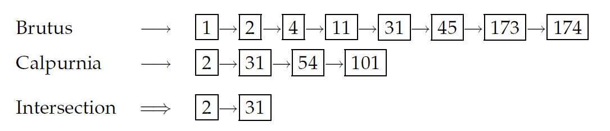
    <figcaption>Intersect Postings</figcaption>
</figure>

The intersection can be achieved efficiently using a merging algorithm. Because the postings are sorted, the algorithm can run in linear time:

```text
Intersect(p1, p2):
    answer <- [] 
    while p1 != NIL and p2 != NIL:
        if docID(p1) == docID(p2):
            ADD(answer, docID(p1))
            p1 <- next(p1)
            p2 <- next(p2)
        elif docID(p1) < docID(p2):
            p1 <- next(p1)
        else:
            p2 <- next(p2)
```
In case there are multiple terms, not only two, the strategy would be sorting the terms by posting lengths, and then performing intersection in that order

```text
Intersect(*terms):
    terms <- SortByIncreasingFrequency(terms)>
    results <- postings(first(terms))
    terms <- rest(terms)

    while terms != NIL and result != NIL:
        result <- Intersect(result, postings(first(terms)))>
        terms <- rest(terms)
    return result
```

### The extended Boolean model versus ranked retrieval

The ranked retrieval model differs from the boolean model because the queries are performed using a more natural language instead of a more structured query language - not to be confound with SQL.

The structured query language is more preferred by domain specialist, while natural language queries are mostly used on the internet. 

    


## The term vocabulary and postings lists
### Document delineation and character sequence decoding

#### Obtaining the character sequence in a document

Some languages have different sequencing scheme - right to left in arabic. The goal is to have a standard sequencing order.

#### Choosing a document unit
Determine what is the document unit used for indexing. 
> for very long documents, the issue of granularity arises.

Choosing a document unit is a precision vs recall trade off:
* small units result in increased precision but decreased recall - the retrieved info is relevant to current query but it misses other relevant information
* big units result in increased recall but decreased precision - the retrieved info contains all the relevant info and irrelevant info.

*The problem can be alleviated by using proximity search*

### Determining the vocabulary of terms
#### Tokenization

Chopping documents into pieces, called tokens, throwing away certain characters - punctuation, -ing.


<figure id="fig:tokenization">
    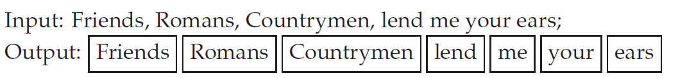
    <figcaption>Tokenization</figcaption>
</figure>

* **token**: instance of sequence of characters
* **type**: class of all tokens containing the same character sequence
* **term**: is a type that is included in the IR system's dictionary

For example, in "to sleep perchance to dream" are 5 tokens, but only 4 terms - two instances of "to". Further, the  "to" term could be excluded because it is a stop word, in the end having only 3 terms

> The issues of tokenization are language-specific. It thus requires the language of the document to be known.
> Items such as the date of an email,
which have a clear semantic type, are often indexed separately as document
metadata

##### Challenges
* Hyphenation - co-driver, driver
* Spaces - New York could be a token, but York can be a token too
* ' - you're, New York's 
* German has compound nouns - "Computerlinguistik" - "computational linguistics". It uses best split matching
* East Asian Languages has the text written without any spaces between works - One approach is to perform work segmentation 

#### Dropping common terms: stop words
Stop words are the words which are of little value when it comes to selecting the documents using a user query. The general strategy for stop word filtering is to sort by *collection frequency* and removing the most frequent ones.

This filtering may hamper some queries
* President of the United States - President United States
* flights to London - flights London

Lately, search engines have reduced the stop words list, even removing it completely.

#### Normalization (equivalence classing of terms)
> Token normalization is the process of canonicalizing tokens so that matches occur despite superficial differences in the character sequences of the tokens

The most standard way to normalize is to create equivalence classes - *anti-discriminatory* and *antidiscriminatory* mapped to  the same term ***antidiscriminatory***

One advantage of equivalence classing is being implicit - no need to compute it in advance. It is easy to write rules for character removal, but it is hard to insert the needed characters back. For example: where to add the hyphen for *antidiscriminatory*

One solution would be to keep a link to the original token.

Common Normalizations:
* Accents and diacritics - In English, diacritics play a marginal role, so they can be removed. In many other languages, diacritics play a bigger role, in such case, the task becomes more challenging.
* Capitalization/case-folding - Cannot perform for every token - CAT vs cat - it can result in retrieving the wrong documents because, for previous example, CAT is an organization, and cat is something else. For english, the heuristic is to lower-case the words at the beginning of a sentence and all the words occuring in the title.
* Other issues in English: dates, numbers
* Other languages: in french, "the" has many forms - they have to be equivaleted as "the". Every language has its peculiarities, one has to accommodate them when dealing with normalizations.

#### Stemming and lemmatization
> The goal of both stemming and lemmatization is to reduce inflectional forms and sometimes derivationally related forms of a word to a common base form
> $\text{am, are, is}\Rightarrow \text{be}$
> $\text{car, cars, car’s, cars’} \Rightarrow \text{car}$


* **Stemming**: crude heuristics that removes the ends of the words
    * Porter’s algorithm
    * Lovins stemmer
* **Lemmatization**: uses a vocabulary and morphological analysis in order to remove inflections and return the base word as in the dictionary
  * 

> Stemmers use language-specific rules, but they require less knowledge than a lemmatizer

As stemmer increases recall while harms precision, and a lemmer does the opposite. Also, a lemmer add computational complexity to the pipeline, while a stemmer does not. Empirically, a stemmer does well, even when compared a lemmer. The situation is different for languages with much more morphology, where a lemmer would result in better retrieved samples

### Faster postings list intersection via skip pointers

Instead of intersecting two posting by incrementing the offset by 1, we can increment it by a k. This way we can skip multiple documents that do not appear in the other posting list.

There is trade off when it comes to the length of the skipping offset. 

* smaller offset means more skips to make
* bigger offset means few opportunities to skip

### Positional postings and phrase queries

#### Biword Indexes

Instead of on being used as a term, two word are used. 
Nouns and noun phrases have a special status when it comes to queries. Related nouns can be separated from the related nouns by various function words: "The abolition of slavery" and "The renegotiation of the constitution". One way of solving this is using part-of-speech-tagging. Each proper nouns and nouns are tagged with $\text{N}$, and the function words, including articles and prepositions, are tagged with $\text{X}$. The extended biword is made by using the following rule: $NX^{*}N$.

* *phrase index*: the index includes variable length word sequences

Using multiple words as indexes has the following:
* advantages:
  * high precision
* disadvantages:
  * but it cam hamper recall
  * the size of the vocabulary increases

#### Positional indexes

For each ter, in the vocabulary, the postings include, besides the $\text{docId}$, the positions in the document.

<figure id="fig:positional_indexes">
    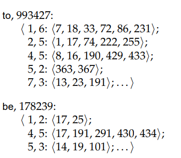
    <figcaption>Positional Indexes</figcaption>
</figure>

Having this type of index, we can match biword terms, and also n-word terms.

***Positional Indexing expands significantly the space complexity***

#### Combination Schemes
> A combination strategy uses a phrase index, or just a biword index, for certain queries and uses a positional index for other phrase queries

## Dictionaries and tolerant retrieval
### Search structures for dictionaries
Classically, the dictionary can be implemented as a *hash table* or *search trees*. The entries in the vocabulary data structure is call a *key*.
The choice of solution is made based on the following questions:
1. How may keys
2. static or change a lot
   1. only insert
   2. or delete too
3. relative frequencies with which various keys will be accessed.

Hash table has been used for dictionary lookups in some query engines. Although hash table seem like a viable solution, there some limitations:
* hash function might change - the vocabulary keeps growing - the could be may collisions in the future
* wildcard queries do not work: ne*

A more convenient solution is using trees, more specifically B-trees. Using this structure, we can handle wildcard queries such as: \*suffix, prefix\*, and suffix\*prefix, if using two tree: normal tree and reverse tree.

### Wildcard queries

Using a tree structure, we can handle wildcard queries such as: \*suffix, prefix\*, and suffix\*prefix, if using two tree: normal tree and reverse tree.

#### General wildcard queries
* Permuterm indexes
  * Rotate terms
  * store them in db
  * rotate tokens such that the \* wildcard ends up at the end of the word
#### K-gram indexes for wildcard queries

Using Permuterm, the space requirements might increase ten-fold. An alternative would be creating another index dictionary, which contains k-grams which point to the vocabulary terms.
<figure id="fig:k_gram_postings">
    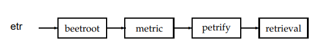
    <figcaption>K-gram postings</figcaption>
</figure>

### Spelling correction
#### Edit distance
> Given two character strings s1 and s2, the edit distance between them is the minimum number of edit operations required to transform s1 into s2

Searching using edit distance would result in big performance hit. Some heuristics are used to overcome these issues.

#### k-gram indexes for spelling correction
use k-gram to narrow down the terms for which the edit distance will be computed

#### Context sensitive spelling correction
#### Phonetic correction
> The main idea here is to generate, for each term, a “phonetic hash” so that similar-sounding terms hash to the same value.

## Index construction

### Hardware basics
* > Access to data in memory is much faster than access to data on disk
*  seek time for HDD
*  > Operating systems generally read and write entire blocks
*  IO-bound vs CPU-bound
*  
### Blocked sort-based indexing
Basic workflow building a non-positional index is depicted in [Figure](#fig:build_inverted_index).

* User $\text{termId}$ instead of term - more efficient
  * build it on the fly - using one pass
  * two pass - when disk space is scarce

### Single-pass in-memory indexing 
Stream the term-doc 

### Distributed indexing

<figure id="fig:distributed_indexing">
    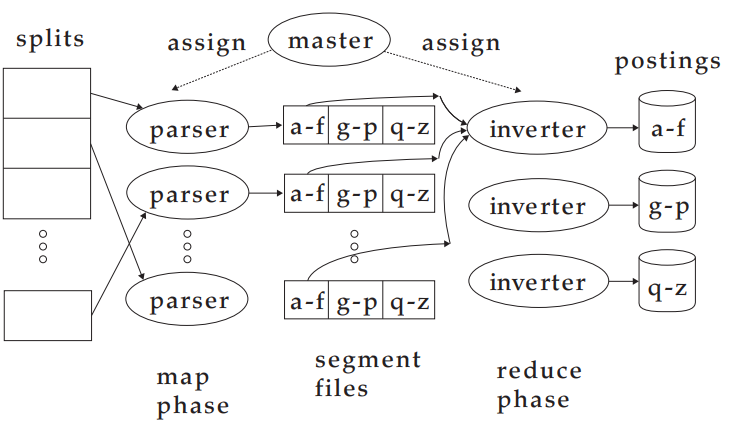
    <figcaption>Distributed Indexing</figcaption>
</figure>

### Dynamic indexing
> The simplest way to achieve this is to periodically reconstruct the index
from scratch.

## Index compression
* Saves disk memory
* More caching
* Faster transfer from disk to memory

### Statistical properties of terms in information retrieval
> Case folding, stemming, and stop word elimination are forms of lossy compression
#### Heaps' law: Estimating the number of terms
$$M = kT^b$$
where $T$ is the number of tokens in the collections. Typical values parameters $k$ and $b$ are : $30 \le k \le 100$ and $b \approx 0.5$

#### Zipf’s law: Modeling the distribution of terms
> It states that, if t1 is the most common term in the collection, t2 is the next most common, and so on, then the collection frequency cfi of the ith most common term is proportional to $\frac{1}{i}$
$$cf_i \propto \frac{1}{i} $$

### Dictionary compression
> the main goal of compressing the dictionary is to fit it in main memory, or at least a large portion of it

#### Dictionary as a string

<figure id="fig:single_string_dict">
    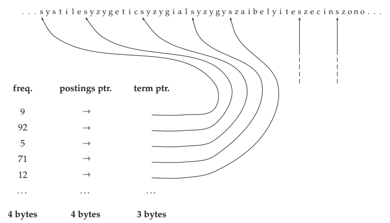
    <figcaption>Single String Dictionary</figcaption>
</figure>

#### Blocked storage

<figure id="fig:block_storage">
    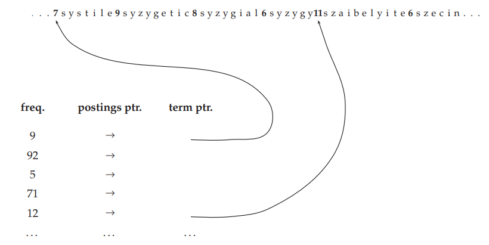
    <figcaption>Block Storage</figcaption>
</figure>

### Postings file compression
#### Variable byte codes
#### $\gamma$ codes

## Scoring, term weighting and the vector space model
### Parametric and zone indexes
#### Weighted zone scoring
weight the score if the query term appears in a particularly zone.
#### Learning weights
#### The optimal weight g
### Term frequency and weighting
> number of occurrences of term t in document d

$\text{tf}_{\text{t,d}}$ mean term frequency for term $\text{t}$ in document $\text{d}$
#### Inverse document frequency
Not all terms are created equally, meaning that using only term frequency might return misleading results.

* $\text{df}_t$ - *document frequency*
* $\text{cf}_t$ - *collection frequency*
> Intuitively, we want the few documents that contain insurance to get a higher boost for a query on insurance than the many documents containing try get from a query on try.

$$\text{idf}_t = \log \frac{N}{\text{df}_t}$$
> Thus the idf of a rare term is high, whereas the idf of a frequent term is
likely to be low

#### Tf-idf weighting
$$\text{tf-idf} = \text{tf}_{\text{t,d}} \times \text{idf}_t$$
1. high value if a term $t$ occurs many times in specific documents
2. lower when the term $t$ occur fewer times in a/many documents
3. lowest when occurs in every document

The score of the document is given by the sum of every query term tf-idf score
$$\text{Score}\left(q, d\right) = \Sigma_{t \in q} \text{tf-idf}_{\text{t,d}}$$

### The vector space model for scoring
#### Dot products
Let $\vec{\text{V}}\left(d\right)$ be the vector derived from document $d$, with one component in the vector for each dictionary term - it  can be the vectors produced by computing $\text{tf-idf}_{\text{t,d}}$. 

Possible similarity quantifiers
* Vector distance - not robust when the documents length increases
* *cosine similarity* - $\text{sim}\left(d_1, d_2\right) = \frac{\vec{V}\left(d_1\right) \cdot \vec{V}\left(d_2\right)}{\left\vert\vec{V}\left(d_1\right)\right\vert\left\vert\vec{V}\left(d_2\right)\right\vert}$ - the denominator acts as a normalizer. Now, it is more robust to documents length
*  *inner product* - again, suffers from document length. can be overcame if the vectors are normalized

A collection of N documents as a collection of vectors can be view as a matrix $M \in \mathbb{R}^{\left\vert T \right\vert \times \left\vert N \right\vert}$, where $\left\vert T \right\vert$ is number of terms, and $\left\vert N \right\vert$ being the number of documents

#### Queries as vectors
#### Computing vector scores
### Variant tf-idf functions
#### Sublinear tf scaling
$$\text{wf}_{t,d} = \left\{
\begin{array}{ll}
      1 + \log \text{tf}_{t,d} & \text{if tf}_{t,d} > 0 \\
      0  & \text{otherwise}\\
\end{array} 
\right. 
$$
results in $\text{wf-idf}_{t,d} = \text{wf}_{t,d} \times \text{idf}_t$

#### Maximum tf normalization
$$
\text{ntf}_{t,d} = a + \left( 1 - a \right)\frac{\text{tf}_{t,d}}{\text{tf}_{\text{max}}\left(d\right)}
$$

Mitigate higher term frequencies due to big documents

the approach fails:
1. a change in the stop words - to much weight
2. outlier term

#### Document and query weighting schemes
first 3 letters are for document weight, the other 3 are for query: $ddd.qqq$

<figure id="fig:dddqqq">
    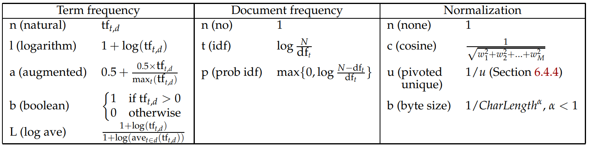
    <figcaption>DDDQQQ</figcaption>
</figure>

#### Pivoted normalized document length
## Computing scores in a complete search system
### Efficient scoring and ranking


#### Inexact top K document retrieval

retrieve top-k almost the best documents:
1. find a set A of documents $K \lt \left\vert A \right\vert \ll N$
2. Return k top-scoring elements in A


#### Index elimination
1. Only consider the query term whose $\text{idf}$ exceeds a certain threshold
2. Only consider documents  which contain many or all the query terms

#### Champion lists

for each term, precompute the top $r$ ($r \gg k$) documents. Instead of iterating on the whole posting list for each query, iterate only on the to $r$. $r$ doesn't have to be the same for every term

#### Static quality scores and ordering

Order the documents in a posting list by  *static quality scoring*. Then, this static quality scoring can be combined with different weighting mechanisms 

#### Impact ordering
Order the posting lists in an decreasing manner and accumulate the total score:
1. We can stop after $r$ documents, or we can stop after crossing a threshold
2. ordering the query terms by decreasing $\text{idf}$ - the most important terms will be processed first

#### Cluster pruning

1. Pick $\sqrt{N}$ documents at random from the collection - call them *leaders*
2. for each document that is not a leader, we compute the nearest leader. The other documents are called followers. There will be $\frac{N}{\sqrt{N}} = \sqrt{N}$ followers

Processing a query goes as:

1. Given a query q, find the leader L that is closest to q. computes cosine similarities from q to each of the $\sqrt{N}$ leaders
2. The set A consists of L togheter with its followers

<figure id="fig:cluster_pruning">
    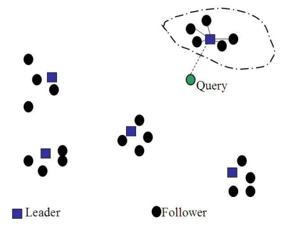
    <figcaption>Cluster Pruning</figcaption>
</figure>

### Components of an information retrieval system

#### Tiered indexes

For each tier there can be a tier threshold. If no documents can be retrieved from tier one, we proceed with tier 2, and so on.

<figure id="fig:tiered_indexing">
    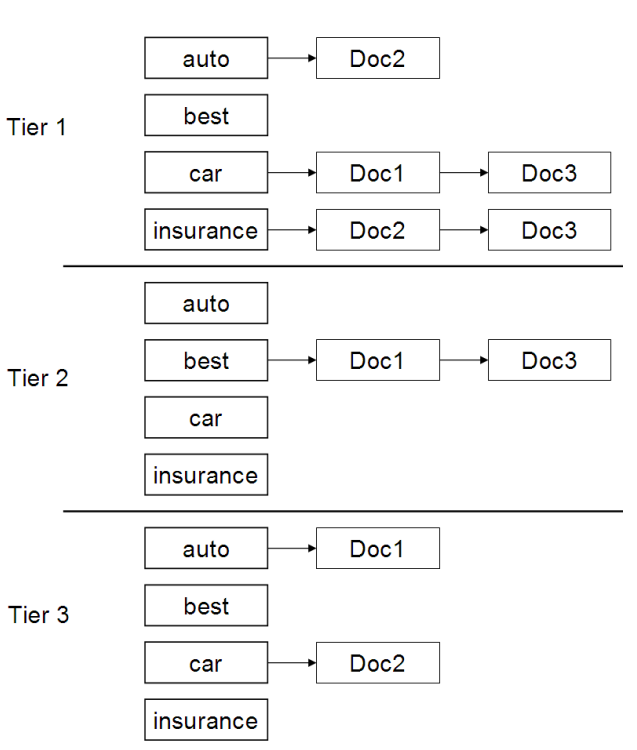
    <figcaption>Tiered Indexing</figcaption>
</figure>

#### Query-term proximity 
> Especially for free text queries on the web, users prefer a document in which most or all of the query terms appear close to each other

#### Designing parsing and scoring functions
>  Typically, a query parser is used to translate the user-specified keywords into a query with various operators that is executed against the underlying indexes.

Sometimes, using query parser, there my be a stream of queries:
1. run user-generated query string as a phrase query
2. if the number of retrieved document is smaller than a given k, run a 2-term phase queries
3. if we still have fewer than k documents, run query with every individual term

#### Putting it all together

<figure id="fig:retriever_architecture">
    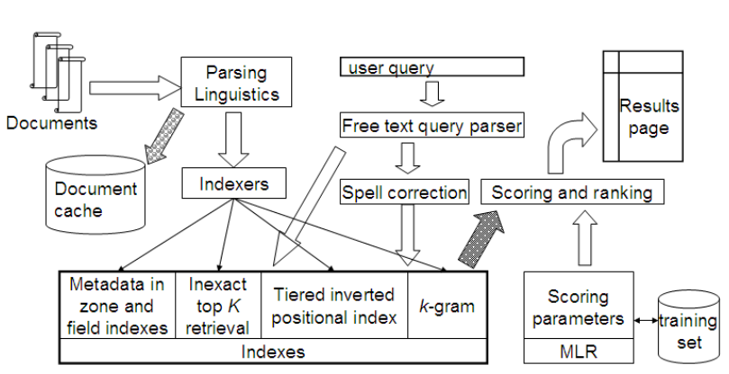
    <figcaption>Retriever System Architecture</figcaption>
</figure>

### Vector space scoring and query operator interaction

#### Boolean retrieval

using vector like indexing we can replicated boolean retrieval quite easy. The other way around is harder (p-norms)

#### wildcard queries
It can be achieved using vector based indexing

#### Phrase queries

## Evaluation in information retrieval

###  Information retrieval system evaluation
In order to measure an information retrieval system we need:
1. a document collection
2. queries
3. relevant or non relevant query-document pair

### Standard test collections
### Evaluation of unranked retrieval sets

**Contingency Table**

|               | Relevant            | Non-relevant        |
| ------------- | ------------------- | ------------------- |
| Retrieved     | true positive (tp)  | false positive (fp) |
| Not Retriever | false negative (fn) | true negative (tn)  |


1. Precision
    * $\text{Precision} = \frac{\#\left(\text{relevant items retrieved}\right)}{\#\left(\text{retrieved items}\right)} = P\left(\text{relevant}\vert \text{retrieved}\right)$
    * $P = \frac{tp}{tp + fp}$
2. Recall
    * $\text{Recall} = \frac{\#\left(\text{relevant items retrieved}\right)}{\#\left(\text{relevant items}\right)} = P\left(\text{retrieved} \vert \text{relevant}\right)$
    * $R = \frac{tp}{tp + fn}$
3. Accuracy
   * $\text{Accuracy} = \frac{\left(tp + tn\right)}{\left(tp + fp + fn + tn\right)}$
   * not rly appropriate for lots of reasons: biased when the data is skewed

4. $F$ *measure* - tradeoff between precision and recall
   * $F =  \frac{1}{\alpha\frac{1}{P} + \left(1 - \alpha\right)\frac{1}{R}} = \frac{\left(\beta^2 + 1\right)PR}{\beta^2P + R}$, where $\beta^2 = \frac{1 - \alpha}{\alpha}$, $\alpha \in \left[0,1\right]$ then $\beta \in \left[0, \infin\right]$. If we want to balance precision and recall, then $\alpha$ has to be $\alpha = \frac{1}{2}$, which make $\beta = 1$, thus $F$ *measure* becomes $F_1$ *measure*: $F_{\beta=1} = \frac{2PR}{P + R}$
### Evaluation of ranked retrieval results

1. Precision-Recall curves
    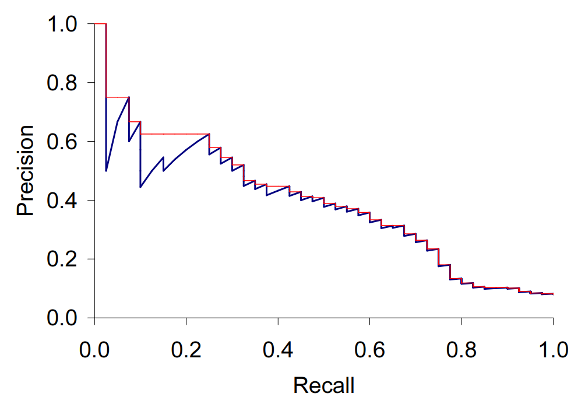
    * The blue line is called precision-recall curve, while the red line is called interpolated precision-recall: $p_{interp}\left(r\right) = \underset{r^{'} \ge r }{\text{max}} \text{ } p\left(r^{'}\right)$. 
    * Most of the time, the average precision is computed - for every query - only at fixed 11 recall values  $\left\{0.0, 0.1, \dots 1.0\right\}$
    * **Mean-Average-Precision**
      * $\text{MAP}\left(Q\right) = \frac{1}{\left\vert Q\right\vert} \sum_{j=1}^{\left\vert Q\right\vert} \frac{1}{m_j}\sum_{k=1}^{m_j}\text{Precision}\left(R_{jk}\right)$
    * **Precision at k** - k has huge influence on the resulting precision
    * **R-precision** - having R *relevant* documents. If there are $\left\vert Rel \right\vert$ relevant documents for a query, we examine the first $\left\vert Rel \right\vert$ retrieved documents. If $r$ document are relevant to the query then both precision and recall can be computed as $\frac{r}{\left\vert Rel\right\vert}$
    * ROC - curve - Because the set of true negatives is huge, the false negative rate would be 1 most of the cases, meaning the metric would tell us the true behavior of the retrieval system
    * **Normalized Discounted Cumulative Gain**
      * $\text{NDCG}\left(Q, k\right) = \frac{1}{\left\vert Q\right\vert}\sum_{j=1}^{\left\vert Q\right\vert} Z_{kj}\sum_{m=1}^{k}\frac{2^{R\left(j, m\right)}-1}{\log_2\left(1 + m\right)}$

### Assessing relevance

* In social sciences, the agreement between two judges is given by $kappa$ statistics: $kappa = \frac{P\left(A\right) - P\left(E\right)}{1 - P\left(E\right)}$
  * $P\left(A\right)$ - proportion of agreement
  * $P\left(E\right)$ - proportion of agreement by chance
  * $P\left(E\right) = P\left(\text{relevant}\right)^2 + P\left(\text{relevant}\right)^2$ 

### A broader perspective: System quality and user utility
#### System issues
* How fast does it index
* How fast does it search
* How expensive is its query language
* How large is its document collection

#### User Utility
> Measuring the rate of return of users is thus an effective metric
> the fraction of searchers who become buyers
> how much time do users spend looking for information that they need

#### Refining a deployed system
* A/B testing

### Results snippets

The retrieved information should be presented to the user. In this case, the document should be minimized - static or dynamic

1. Static - the summary doesn't change based on the query
2. Dynamic
   * Text Summarization
   * *Keyword-in-context* (KWIC)


## Relevance feedback and query expansion

1. Global Methods
   * Query expansion
   * Spelling correction
2. Local 
   * Relevance feedback
   * Pseudo relevance feedback
   * Indirect relevance feedback

### Relevance feedback and pseudo relevance feedback

1. The user issues a (short, simple) query.
2. The system returns an initial set of retrieval results.
3. The user marks some returned documents as relevant or non-relevant. 
4. The system computes a better representation of the information need based on the user feedback.
5. The system displays a revised set of retrieval results.

#### The Rocchio algorithm for relevance feedback

<figure id="fig:rocchio">
    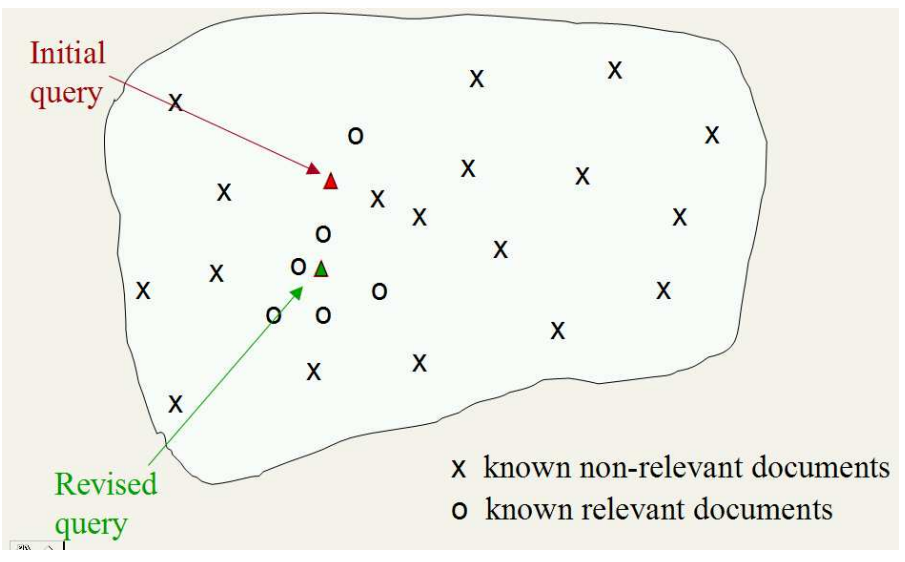
    <figcaption>Rocchio Algorithm</figcaption>
</figure>

Starting with a query $\vec{q}_0$, the proposed query is computed as follows:

$$
\vec{q}_m = \alpha \vec{q}_0 + \beta\frac{1}{\left\vert D_r\right\vert} \sum_{\vec{d}_j \in D_r} \vec{d_j} - \gamma \frac{1}{\left\vert D_{nr}\right\vert} \sum_{\vec{d}_j \in D_{nr}} \vec{d}_j
$$

where $D_r$ means relevant documents, $D_nr$ means not relevant documents, and $\left\{\alpha, \beta, \gamma\right\}$ are weighting parameters.

In practice, this algorithm improves recall

#### Probabilistic relevance feedback
#### When does relevance feedback work?

* Queries should be written in the same language
* Queries should use similar vocabulary
* Similar documents should cluster together
* Documents can belong to multiple cluster, not only one

> Relevance feedback is not necessarily popular with users.
> Some experimental results have also suggested that using a limited number of terms like this may give better results

#### Relevance feedback on the web
> relevance feedback is hard to explain to the average user, and relevance feedback is mainly a recall enhancing strategy, and web search users are only rarely concerned with getting sufficient recall.

#### Evaluation of relevance feedback strategies
#### Pseudo relevance feedback

Use all top k documents as relevant

####  Indirect relevance feedback
### Global methods for query reformulation
####  Vocabulary tools for query reformulation
Interact with the IR vocabulary
####  Query expansion
> users give additional input on query words or phrases, possibly suggesting additional query terms.

* suggest related queries in response to a query

#### Automatic thesaurus generation


## XML retrieval
### Basic XML concepts
### Challenges in XML retrieval
> Structured document retrieval principle. A system should always retrieve the most specific part of a document answer
### A vector space model for XML retrieval
### Text-centric vs. data-centric XML retrieval

## Probabilistic information retrieval
### Review of basic probability theory
### The Probability Ranking Principle (PRP)

#### The 1/0 loss cas
$P\left(R =1 \vert d, q\right)$

#### The PRP with retrieval costs
$$C_0 \cdot P\left(R=0\vert d\right) - C_1 \cdot P\left(R=1\vert d\right) \le C_0 \cdot P\left(R=1\vert d^{'}\right) - C_1 \cdot P\left(R=1\vert d^{'}\right)$$

where $C_0$ is the cost of retrieving a nonrelevant document, and $C_1$ is the cost of retrieving a relevant document

###  The Binary Independence Model
#### Deriving a ranking function for query terms
#### Probability estimates in theory
#### Probability estimates in practice

> Under the assumption that relevant documents are a very small percentage of the collection, it is plausible to approximate statistics for nonrelevant documents by statistics from the whole collection
#### Probabilistic approaches to relevance feedback


## Flat clustering

### Clustering in information retrieval

> **Cluster hypothesis**. Documents in the same cluster behave similarly with respect to relevance to information needs.

* Scatter-Gather

### Problem statement
### Cardinality – the number of clusters
* Hard to guess
### Evaluation of clustering
* Purity
* Normalized mutual information

### K-means
#### Cluster cardinality in K-means
1. Elbow method
2. $K = \text{argmin}_{K} \left[\text{RSS}_{min}\left(K\right) + \lambda \cdot K\right]$ - penalizes the number of  clusters $\text{K}$
3. AIC - Akaike Information criterion

### Model-based clustering
* Expectation Maximization (EM) algorithm - a generalization of k-means clustering, offering a soft assigment

## Hierarchical clustering
### Hierarchical agglomerative clustering
* top-down
* bottom-up
* visualized as a dendrogram

#### Similarities
1. single-link: maximum similarity
2. complete-link: minimum similarity
3. centroid: average inter-similarity
4. group-average: average of all similarities

##### Single-link and complete-link clustering

#### Time complexity of HAC
1. Cubic time complexetiy
   1. Use Priority Queue

#### Group-average agglomerative clustering
#### Centroid clustering
### Optimality of HAC

### Divisive clustering
### Cluster labeling

## Matrix decompositions and latent semantic indexing