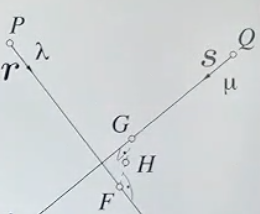

# Triangulation

## Mid-point triangulation
> Due to the fact that the points are estimated, the rays may not intersect. A solution to solve this issue is using a mid point.

{style="display: block; margin: 0 auto" }

$$
\begin{align*}
    f = p + \sigma \cdot r \qquad g = q + \mu \cdot s \\
\end{align*}
$$

* Where $p = X_{O^{'}}$ and $q = X_{O^{''}}$ are the camera origins
* And the directions are given by $r = R^{'T} \cdot x^{'}_{k}$ and $s = R^{''T} \cdot x^{''}_{k}$
* With $x^{'}_{k} = \left(x^{'}, y^{'}, c\right)^{T}$ and $x^{''}_{k} = \left(x^{''}, y^{''}, c\right)^{T}$
* Let $v_{fg} = f - g$. The vector $v_{fg}$  should be orthogonal on both lines:
$$
\begin{align*}
    v_{fg} \cdot r = 0 \qquad v_fg \cdot s = 0
\end{align*}
$$
which leads to:
$$
\left(q + \sigma s  - p - \mu r \right) \cdot s = 0 \\
\left(q + \sigma s  - p - \mu r \right) \cdot r = 0
$$
* By solving the above system, the unknowns $\sigma$ and $\mu$ will be used to compute $F$ and $G$.
* Using $F$ and $G$, the midpoint can be computed using a simple average

