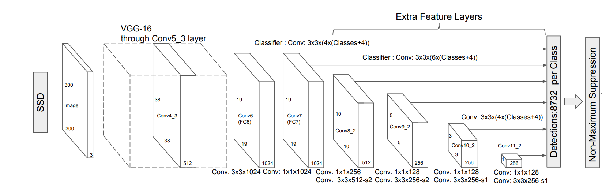

# Detection Architectures

## RetinaNet object detector

* The main obstacle to close the gap between two stage detectors and one stage detector is the class imbalance
* In order to overcome this, the proposed solution is a new loss function
* The new loss function is a dynamically scaled cross entropy loss, where the scaling factor decays to zero as confidence in the correct class increases.
* A common technique for dealing with class imbalance was hard sampling mining.
* Another technique was to use robust loss functions (Huber loss)

### Architecture

* ResNet Backbone
* FPN Neck
* Regression head and Classification head

The box prediction is made using anchors. The anchors are extracted for every FPN level.

### Loss Function
$$FL(p_t) = - \alpha * (1 - p_t)^{\gamma}\log(p_t)$$

If $p_t$ increases, the loss will decrease. This means that the correctly classified samples are discounted when it comes to loss computation.
## SSD object detector

* Fully convolution architecture
* Uses anchor boxes at multiple feature maps
* For a $m \times n$ feature map, the result will be $(4 + c) \times k \times m \times n$. Where $c$ is the number of classes, $k$ the number of boxes per cell.

### Training
* Match ground truth boxes to default boxes
* Select matches with Jaccard overlap higher than a 0.5 threshold.
* Hard negative mining. Pick boxes with top confidence so the ratio between negatives and positives will be 3:1.

### Loss

The objective loss is a weighted sum of localization loss and confidence loss

$$ L = \frac{1}{N} \ast (L_{conf} + \alpha \ast L_{loc})$$

Where $N$ is the number of default boxes.

#### Localization Loss

$$L_{loc}(x, l, g) = \Sigma_{i \in Pos}^{N}\Sigma_{m \in \{cx, cy, w, h\}} x_{ij}^{k} smooth_{L1}(l_{i}^{m} - \hat{g}_{j}^{m})$$

Where:
$x_{ij}^p$ is 1 if $i-ith$ default box is matched to $j-th$ ground truth box of category $p$.

$$
\hat{g}_j^{cx} = \frac{g^{cx}_j - d^{cx}_i}{d^w_i},
\hat{g}_j^{cy} = \frac{g^{cy}_j - d^{cy}_i}{d^h_i}
\hat{g}_j^{w} = \log \frac{g_j^w}{d_j^w},
\hat{g}_j^{h} = \log \frac{g_j^h}{d_j^h}
$$

#### Confidence Loss
$$L_{conf} = - \Sigma_{i \in Pos}^N x_{ij}^p \log(\hat(c)_i^p) - \Sigma_{i \in Neg} \log(\hat(c)_i^0) $$

### Default Boxes

The default boxes are selected across multiple feature maps, with varying sizes.
$$s_{k} = s_{min} + \frac{s_{max} - s_{min}}{m-1} \ast (k - 1), k \in [1, m]$$
$m$ is the number of feature maps.

For every size there are multiple aspect ratios: $\{1, 2, 3, \frac{1}{2}, \frac{1}{3}\}$. The width can be extracted as following: $w^a_k = s_k \ast \sqrt{a_r}$. The same goes for height: $wh^a_k = \frac{s_k}{\sqrt{a_r}}$
The center of each default box is set to $\frac{i + 0.5}{f_k}, \frac{j + 0.5}{f_k}$, where $f_k$ is the size if $kth$ feature map.

### Architecture

The architecture is a fully convolutional neural network. Instead of using only the last layer for prediction, SSD architecture uses multiple levels.
SSD approach can be adapted to any other convolutional architecture.

