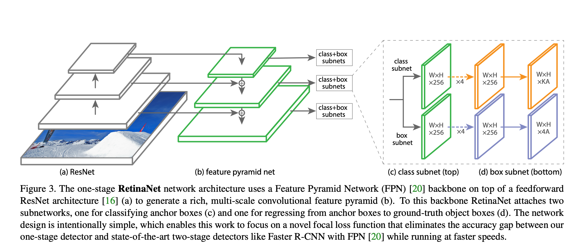

# Detection Architectures

## RetinaNet Architecture

* The main obstacle to close the gap between two stage detectors and one stage detector is the class imbalance
* In order to overcome this, the proposed solution is a new loss function
* The new loss function is a dynamically scaled cross entropy loss, where the scaling factor decays to zero as confidence in the correct class increases.
* A common technique for dealing with class imbalance was hard sampling mining.
* Another technique was to use robust loss functions (Huber loss)

### Architecture

* ResNet Backbone
* FPN Neck
* Regression head and Classification head

