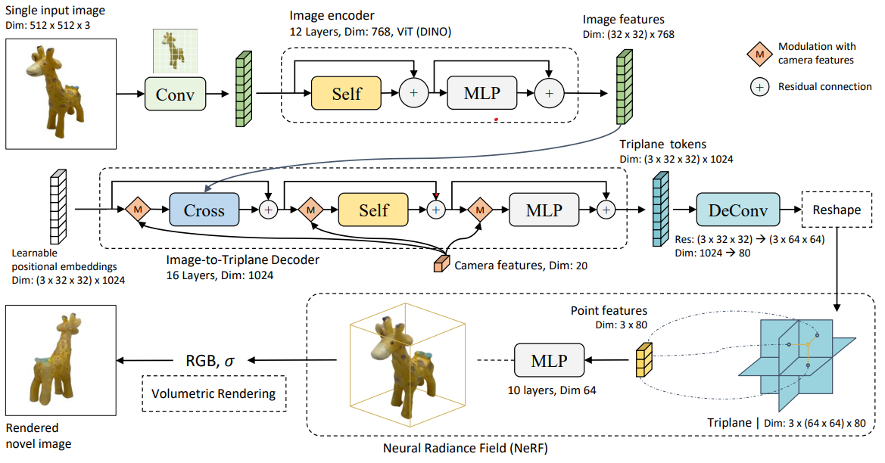

# LRM

## [Efficient Geometry-aware 3D Generative Adversarial Networks](https://arxiv.org/pdf/2112.07945)
TLDR: Triplane goes brr
## [LRM: LARGE RECONSTRUCTION MODEL FOR SINGLE IMAGE TO 3D](https://arxiv.org/pdf/2311.04400.pdf)

### Approach
# 
#### Image Encoder 
Applies a pre-trained visual transformer (ViT) to encode the image into patch-wise feature tokens

#### Image to Triplane Decoder 

> Uses triplane representation for points feature computation
1. Cross attention between learnable positional embeddings and images features
2. Self attention
3. Deconvolution
4. All of the above are modulated by using camera features 

#### Triplane Nerf
1. trilinear interpolate point using the resulted triplane 
2. apply MLP on the point features, resulting a rgb and $\alpha$
3. apply loss

### Loss 
$$
\mathcal{L}_{\text{recon}}\left(\bold{x}\right) = \frac{1}{V} \sum_{v=1}^{V}\left(\mathcal{L}_{\text{MSE}}\left(\hat{x}_{v}, x^{\text{GT}}_{v}\right) + \lambda \mathcal{L}_{\text{LPIPS}}\left(\hat{x}_{v}, x^{\text{GT}}_{v}\right)\right)
$$

## [InstantMesh: Efficient 3D Mesh Generation from a Single Image with Sparse-view Large Reconstruction Models](https://arxiv.org/pdf/2404.07191.pdf)