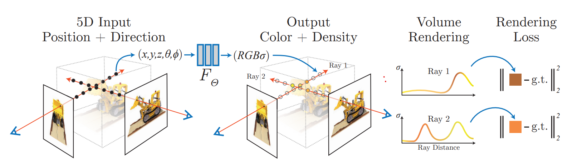
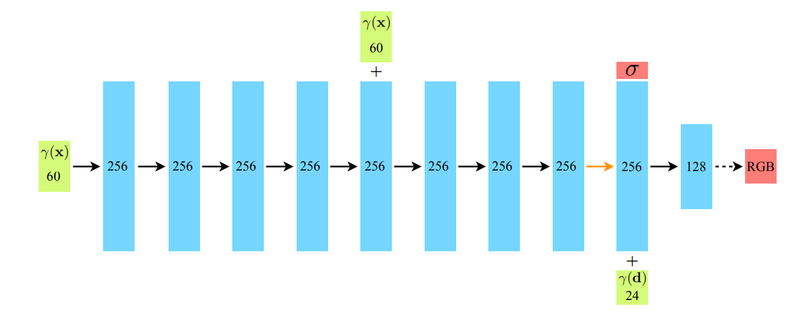
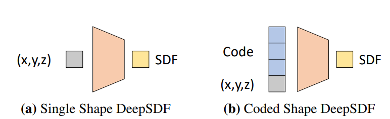
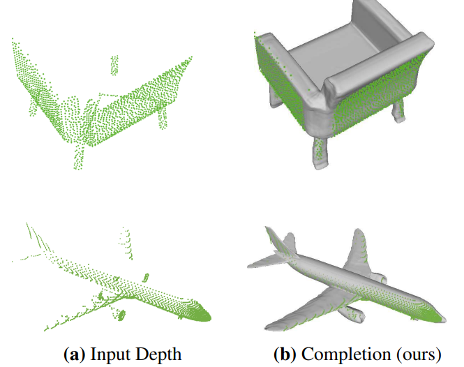
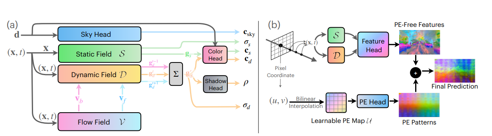
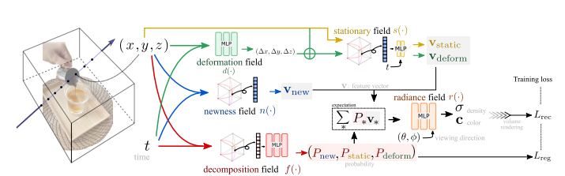
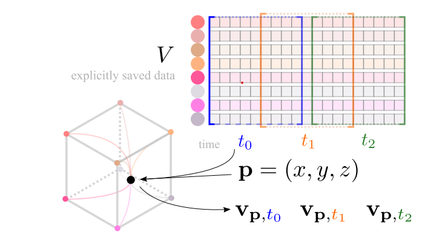
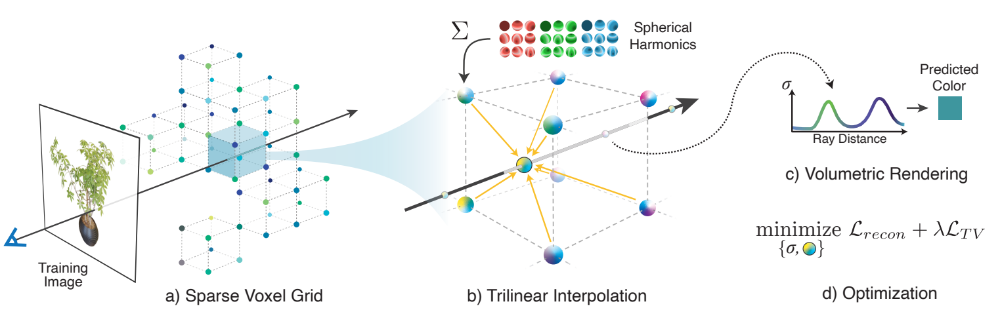

# Neural Rendering
## [Neural Volume Rendering: NeRF and Beyond](https://arxiv.org/pdf/2101.05204.pdf)

* What is neural volume rendering?
  > generates image or video by tracing a ray into the scene and taking and integral over the ray length

* The precursors to NeRF use SDF, Occupancy nets and others. More info in section 2 of ["Neural Volume Rendering: NeRF and Beyond"](#neural-volume-rendering-nerf-and-beyond-link)

* One influential paper was ["Neural Volumes: Learning Dynamic Renderable Volumes from Images"](https://arxiv.org/pdf/1906.07751.pdf)

### NeRFs

The [NeRF](https://arxiv.org/pdf/2003.08934.pdf) approach was inspired by [DeepSDF](https://arxiv.org/pdf/1901.05103.pdf), but they regress density and color instead of a signed distance function.

Because the method was brutally simple - using a MLP with 5D input - there was plenty room for improvement. The following opportunities were were most salient:
1. Speed. It is slow
2. It can only represent static scenes
3. Bakes in the lighting
4. A trained NeRF doesn't generalize to other scenes/objects.

#### Improvements
##### Performance
1. JaxNeRF - uses jax to speed up training
2. [AutoInt](https://arxiv.org/pdf/2012.01714.pdf) - learns the volume integral directly
3. [Learned Initialization](https://arxiv.org/pdf/2012.02189.pdf) - Uses meta-learning to find good weight initialization
4. [DeRF](https://arxiv.org/pdf/2011.12490.pdf) - uses voronoi
5. [NERF++](https://arxiv.org/pdf/2010.07492.pdf) - uses another NeRF to model the background
6. [Neural Space Voxel Fields](https://proceedings.neurips.cc/paper_files/paper/2020/file/b4b758962f17808746e9bb832a6fa4b8-Paper.pdf) - organize the scene into sparse voxel octree to speed up the rendering by a factor of 10
##### Dynamic
1. [Nerfies](https://arxiv.org/pdf/2011.12948.pdf)
2. [D-NeRF](https://arxiv.org/pdf/2011.13961.pdf)
3. [NeRFlow](https://arxiv.org/pdf/2012.09790.pdf)

##  [NeRF: Representing Scenes as Neural Radiance Fields for View Synthesis](https://arxiv.org/pdf/2003.08934.pdf)

### Related Work
1. [DeepSDF: Learning Continuous Signed Distance Functions for Shape Representation](https://arxiv.org/pdf/1901.05103.pdf)
2. [Local Implicit Grid Representations for 3D Scenes](https://geometry.stanford.edu/papers/jsmhnf-lligrf3s-20/jsmhnf-lligrf3s-20.pdf)
3. [Local deep implicit functions for 3d shape](https://arxiv.org/pdf/1912.06126.pdf)
4. [Occupancy Networks: Learning 3D Reconstruction in Function Space](https://arxiv.org/pdf/1812.03828.pdf)
5. [DeepVoxels: Learning Persistent 3D Feature Embeddings](https://arxiv.org/pdf/1812.01024.pdf)
6. [Neural Volumes: Learning Dynamic Renderable Volumes from Images](https://arxiv.org/pdf/1906.07751.pdf)
7. [Local Light Field Fusion: Practical View Synthesis with Prescriptive Sampling Guidelines](https://arxiv.org/pdf/1905.00889.pdf)
### Summary
Encode the scene into a neural network (Multilayer Perceptron MLP). AS, input it uses a 5D vector. This vector has two parts: 
1. Location $(x, y, z)$
2. Viewing direction $(\theta, \phi)$

And as an output, the model predicts a 4D vector:
1. RGB values $(r, g, b)$
2. Density value $\sigma$

The rendering is done by marching camera rays through the scene, use the points along the ray as the input for the neural network to produce $(r,g,b,\sigma)$, then use classical volume rendering techniques to accumulate those colors and densities into an image. 

The network is optimized using unsupervised approach: minimizing the error between the ground truth image and the image generated via the volume rendering.

**NeRF Pipeline visualization**

One additional step is the encoding of the input into a higher dimensional input. This is achieved by using positional encoding.

### Volume Rendering
The rendering starts by shooting a ray through every pixel in the image. This ray can be represented as $r(t) = o + t * d$, where $o$ is the origin of the ray, $t$ is the distance, and $d$ is the direction. Let $\sigma (x)$ be the probability of a ray terminating at a particle at location x. Using the above variables, the expected color of a camera ray is:
$$C(r) = \int_{t_n}^{t_f}T(t) * \sigma(r(t))*c(r(t), d)dt$$
$$T(t) = \exp{(-\int_{t_n}^{t}\sigma(r(s))ds)}$$

This equation can pe interpreted as the probability $T(t)$ of a ray to travel to particle at position $t$, and the particle at position $t$ will emit the color $c(r(t), d)$ with a probability of $\sigma(r(t))$

The integral is estimated using quadrature. To achieve this, the integral is computed along some uniformly distributed bins.

$$t_i = U[t_n + \frac{i - 1}{N} * (t_f - t_n), t_n + \frac{i}{N} * (t_f - t_n)]$$

Using the above bins, the $C(r)$ equation us computed as follows:
$$\hat{C(r)} = \Sigma_{i=1}^{N} \hat{T_i} * (1 - \exp(-\sigma_i * \delta_i)) * c_i $$
$$\hat{T_i} = \exp (-\Sigma_{j=1}^{i-1}\sigma_i * \delta_i)$$
$$\delta_i = t_{i+1} - t_i$$
### Positional encoding
Due to the neural network's affinity towards learning lower  frequency functions, the networks input is lifted in a higher dimensional representation using the following equation:
$$\gamma(p) = (\sin(2^0 * \pi * p), \cos(2^0 * \pi * p), \ldots, \sin(2^{L-1} * \pi * p), \cos(2^{L -1} * \pi * p) $$

Both, position and direction are encoded using the previous equation. $L=10$ for position, and $L=4$ for direction.
### Hierarchical volume sampling
Due the dense evaluation at every N point, this strategy becomes costly performance wise. To overcome this, the estimation strategy is split int two: 
1. First, a coarse network is applied on fewer samples along the ray, resulting in a PDF along the ray.
2. Using the previously computed PDF, a new denser set of points is sampled. The finer network version is applied on the new denser points.
### Implementation details
For each new scene a new neural network is optimized. The input for the NeRF model should be images and the corresponding camera poses and intrinsic parameters (They use the COLMAP SfM package).

#### Loss
As said previously, the NeRF networks are trained using a self-supervised approach.
$$L = \Sigma_{r \in R} [\| \hat{C_c}(r) - C(r)\|_2^2 + \| \hat{C_f}(r) - C(r)\|_2^2 ]$$

where: $C(r)$ is the ground truth color, $\hat{C_c(r)}$ is coarse estimated color, and  $\hat{C_f(r)}$ is fine estimated color.
### Training

A batch contains rays from the entire dataset. The batch size contains 4096 rays, each sampled at $N_c = 64$ for coarse volume, and $N_f = 128$ for fine volume. The convergence was achieved at 100-300k iterations, around 1-2 days on **NVIDIA V100 GPU**

### Architecture
As stated previously, the whole architecture of the NeRF models is a Feed Forward Network (FFN). The architecture is split in two:
1. First part predict the density $\sigma$ and a 256-dimensional feature vector.
2. The feature vector is concatenated with the ray's viewing direction in order to produce view-dependant RGB color

**NeRF Architecture**

## [AutoInt: Automatic Integration for Fast Neural Volume Rendering](https://arxiv.org/pdf/2012.01714.pdf)
## [Learned Initializations for Optimizing Coordinate-Based Neural Representations](https://arxiv.org/pdf/2012.02189.pdf)
## [Nerfies: Deformable Neural Radiance Fields](https://arxiv.org/pdf/2011.12948.pdf)

1. deformation field helps reconstructing moving objects
2. Joint optimization of the NeRF and deformation fields
3. Elastic regularization on the deformation, background regularization, coarse to fine annealing technique that avoids bad local minima
4. Builds upon NeRF to model deformable scenes
5. Besides location and direction, nerfies add an additional parameter: $\psi_i$ is an appearance latent code for each observed frame, where $i \in \{{1, \ldots n}\}$
6. NeRF relies on the fact that two intersecting rays coming from different cameras should yield the same color. This is true for static scene but not for dynamic ones.

### Neural Deformable Fields
1. Uses canonical template of the scene before adding the rays through NeRF.
2. The mapping to a canonical template can be defined as $T_i \colon x \rightarrow x^{\prime}$, where $i \in{\{1, \ldots, n\}}$, $n$ being the number of frames. The deformation field is modeled using a mapping $T \colon (x, \omega_i) \rightarrow x^{\prime}$, where $\omega$ is per-frame learned latent deformation code.

## [NeRF in the Wild: Neural Radiance Fields for Unconstrained Photo Collections](https://arxiv.org/pdf/2008.02268.pdf)
1. Vanilla NeRF assumes the world is static: the image taken from different poses should identical. The real world violates this
2. modeling per image feature variance 
3. Learning per image of a latent space explainability  in order to explain inter-image changes
4. shared and image dependent elements

Vanilla NeRF assumes consistency in its input  views. This can be violated by the following two phenomena:
1. Photometric variation: time of day, atmospheric conditions, auto-exposure settings, etc.
2. Transient objects: in the real world there are plethora of static and dynamic objects.

### NeRF-W
### Network architecture

#### Latent Appearance
Every image has a iamge-dependent radiance $c_i(t)$. Thus, the expected color equation is rewritten as:
$$\hat{C}_i(r) = R(r, c_i, \sigma)$$
$$c_i(t) = MLP_{\theta_2}(z(t), \gamma_d(d), l_i^{(a)})$$

Where $\{l_i^{(a)}\}_{i=1}^N$ are the embeddings for each image $i$
#### Transient Objects
Two heads: one models static behaviour, while the other one models dynamic behaviour. Using this separation, it enables NeRF-W to reconstruct images containing occluders, without introducing artifacts into the static scene representation. In addition to the previous separation, the model will output an uncertainty field, which will allow the model to adapt its reconstruction loss to ignore the unreliable pixels.
Using both the static and the transient components, the rendering equation will be updated as follows:
$$\hat{C}_i(r) = \Sigma_{k=1}^KT_i(t_k)(\alpha(\sigma(t_k) * \delta_k) * c_i(t_k) + \alpha(\sigma_i^{(\tau)}(t_k) * \delta_k) * c_i^{(\tau)}(t_k))$$

where
$$T_i(t_k) = \exp\left(-\Sigma_{k^{\prime}}^{k-1}\left(\sigma(t_{k^{\prime}} + \sigma_i^{\left(\tau\right)}\left(t_{t^{\prime}}\right)\right) * \delta_{t^{\prime}}\right)$$

The means that the expected color $r(t)$ will $\alpha$ composite of both the static and the transient components.

## [NeRF−−: Neural Radiance Fields Without Known Camera Parameters ](https://arxiv.org/pdf/2102.07064.pdf)
## [Neural Radiance Flow for 4D View Synthesis and Video Processing](https://arxiv.org/pdf/2012.09790.pdf)
1. The goal is to learn scene representation for dynamic scenes
2. NeRFlow learns scene appearance, density and motion jointly

### Architecture 

### Radiance field and flow
#### Radiance field
The radiance function $R_{\theta}$ is 6D function. It takes as input the location $ x = \left( x, y, z, t\right)$ and the viewing direction $\left( \theta, \phi \right)$. As the output, the function estimates the color $c = \left(r, b, g\right)$ and the density $\sigma$. The colr is decomposed into $c_{diffuse}$ and $c_{specular}$

#### Flow Field

The flow field function $F_{\theta}$ represents the underling dynamics of the scene. As input, the function takes the 4D location $x = \left( x, y, z, t\right)$, and, as outputs, the function returns the flow field $\left( f_x, f_y, f_z\right) = (\frac{\partial{x}}{\partial{t}}, \frac{\partial{y}}{\partial{t}}, \frac{\partial{z}}{\partial{t}})$. Given a particular point $X_{t_s} = \left(x_s, y_s, z_s, t_s\right)$, the future position $X_{t_g}$ can be obtained using:
$$\left(x_g, y_g, z_g\right) = \left(x_s, y_s, z_s\right) + \int_{t_s}^{t_g} f\left(x, y, z, t\right)dt $$

### Temporally coherent learning

It consist of 3 elements: 
1. **Appearance consistency**  -  the color of an object remains the same
2. **Density consistency**  -  the density of an object remains the same
3. **Motion consistency**  - empty (low density) spaces should have no motion, and objects move smoothly in natural scenes.

### Learning from Visual Observation
#### Volume rendering for image supervision
Use volume rendering to generate the image, then apply MSE loss between predicted color and ground truth color via $\mathcal{L}_render = ||c_r - RGB||$

#### Optical Flow consistency 

The loss between $X_g = \left(x_g, y_g, z_g \right)$ and a candidate $X_g^c$. $\mathcal{L}_{corr} = ||X_g^c - X_g||$

### Loss

$$ \mathcal{Loss} = \mathcal{Corr} + \alpha * \mathcal{L}_{RGB} +  \beta * \mathcal{L}_{Density} + \mathcal{L}_{Flow} + \mathcal{L}_{Acc}$$

## [Neural Sparse Voxel Fields](https://proceedings.neurips.cc/paper_files/paper/2020/file/b4b758962f17808746e9bb832a6fa4b8-Paper.pdf)

1. It combines neural fields with an explicit sparse voxel structure
2. Speeds up the neural rendering process by an order of 10
3. Produces better visuals

### Approach
#### Voxel-bounded Implicit Fields
Let's assume the scene can be represented using a sparse, non-empty set of voxels  $\mathcal{V} = \left\{ V_1, \ldots, V_k \right\}$. The scene is modeled by the following voxel-bounded functions: $F_{\theta} \left(p, v\right) = F_{\theta}^{i}\left(g_{i}\left(p\right), v\right) $, if $p \in V_i$. Each $F_{\theta}^{i}$ is modeled as a multi-layer perceptron with shared parameters $\theta$. 
$$F_{\theta}^{i} : \left(g_{i}\left(p\right), v\right) \rightarrow \left(c, \sigma\right), \forall p \in V_{i}$$

$c, \sigma$ are the color and density of the 3D point $p$ in $v$ direction. $g_{i}\left(p\right)$ is the representation at $p$:
$$g_{i}\left(p\right) = \zeta\left(\chi\left(\widetilde{g}_{i}\left(p_{1}^{*}\right), \ldots \widetilde{g}_{i}\left(p_{8}^{*}\right)\right)\right)$$

Let's say the point $p$ is inside voxel $V_i$. The $g_i$ function takes the 8 vertices that represent the voxel $V_i$. These 8 vertices are transform into $	\mathbb{R}^d$ vectors by using $\widetilde{g}_i$, then a trilinear interpolation is applied, and lastly the vector is positional encoded (same as in the "Attention is all you need").

#### Volume Rendering
NSVF encodes the color and density of a scene at any point $p \in \mathcal{V}$. Compared to the solutions that model the entire space, NSVF is more efficient as it does not take into account points in the empty space.

Rendering is performed in two steps: 
1. ray-voxel intersection
2. ray-marching inside the voxel

##### Ray-Voxel Intersection

The ray-voxel intersection is performed using Axis Aligned Bounding Box intersection test for each ray. 

##### Ray marching inside voxels

The color is computed using the same approach as in the "OG NeRF", but with additional caveats. The first one being modeling background color by using $A\left(p_{0}, v\right) * c_{bg}$, where $c_{bg}$ is learnable RGB value for background, $A\left(p_{0}, v\right) = \Pi_{i=1}^{N}\alpha\left(z_{i}, \triangle_{i}\right)$ is transparency. The second caveat is employing different sampling strategy. The strategy rejects sample points based on sparse voxels. 

##### Early termination
The points are no longer evaluated if the accumulated transparency $A\left(p_0, v\right)$ drops below a certain threshold $\epsilon$

#### Learning 

##### Loss

$$\mathcal{L} = \sum_{\left(p_{0},v\right) \in R} \|C\left(p_{0}, v\right) = C^{*}\left(p_{0}, v\right)\|_{2}^{2} + \lambda * \Omega\left(A\left(p_{0}, v\right)\right) $$
Where $R$ is the bach of sampled rays, $C^*$ is the ground-truth color for the camera ray, and $\Omega$ is a beta-distribution regularizer proposed in  [[link]](#neural-volumes-learning-dynamic-renderable-volumes-from-images)

##### Self Pruning 

This strategy is employed in order to remove non-essential voxels during training based on model's prediction on density.

$V_i$ is pruned if $\min_{j= 1 \dots G}e^{-\sigma\left(g_{i}\left(p_{j}\right)\right)} > \gamma$, where $p_{j} \in V_{i}$, $V_{i} \in \mathcal{V}$, and $\left\{p_{j}\right\}_{j=1}^{G}$ are G uniformly sampled points inside the voxel $V_i$

The self-pruning process is performed periodically.

##### Progressive Training
Using the self-pruning strategy enables to progressively adjust the voxelization - decreasing the step size along the ray and voxel size
## [Instant Neural Graphics Primitives with a Multiresolution Hash Encoding](https://arxiv.org/pdf/2201.05989.pdf)

The network has trainable weight parameters $\Phi$, but also trainable encoding parameters $\theta$. Encoding parameters are arranged into $L$ levels, each containing up to $T$ feature vectors with dimensionality $F$. 

## [Neural Volumes: Learning Dynamic Renderable Volumes from Images](https://arxiv.org/pdf/1906.07751.pdf)
## [Deep Local Shapes: Learning Local SDF Priors for Detailed 3D Reconstruction](https://arxiv.org/pdf/2003.10983.pdf)
## [DeepSDF: Learning Continuous Signed Distance Functions for Shape Representation](https://arxiv.org/pdf/1901.05103.pdf)

Represents signed distance functions using deep learning. Besides the points location $\left(x, y, z\right)$, the models takes as input an additional code.

Let $SDF\left(x\right)$ function be represented by a neural network (feed forward one). In order to estimate the signed distance function for a shape, the network is applied on 3D point samples.
$$X \coloneqq \left\{\left(\mathcal{x}, s\right) \colon SDF \left(\mathcal{x}\right) = s\right\}$$

In addition to the position, the network takes as input an additional latent code. Using this code, the network will be able to estimate the $SDF$ for a domain, not only a sample.

### Training

The training is performed in a supervised manner, with the loss being:
$$
\mathcal{L}\left(f_{\theta}\left(\bold{\mathcal{x}}\right), s\right) = |\text{clamp}\left(f_{\theta}\left(\bold{\mathcal{x}}, \delta\right)\right) - \text{clamp}\left(s, \delta\right)|
$$

where $\text{clamp}\left(x, \delta\right) \coloneqq \text{min}\left(\delta, \text{max}\left(-\delta, x\right)\right)$, $\delta$ is used to  control the distance to the mesh. 

### Latent codes to sdf
The latent codes are learned in a auto-decoder manner. First, the codes are sampled from a distribution, then the codes are optimized the same was as lookup vocabulary for nlp tasks. Then the network will take an additional input parameter $f_{\theta}\left(z_i, \bold{\mathcal{x}}_j\right)$, $\bold{\mathcal{x}}$ being the 3D position, and $\bold{\mathcal{z}}$ being the latent code.

### Scene completion

This task can be accomplished with a small change to the proposed solution. The addition is free space loss 
$$
  \mathcal{L}_\text{free-space} = \begin{cases}
    0 & \text{ if } f_{\theta}\left(\mathcal{z}, \mathcal{x})\right) < 0
    \\
    |f_{\theta}\left(\mathcal{z}, \mathcal{x})\right)| & \text{ else }
  \end{cases}
$$

## [acorn: Adaptive Coordinate Networks for Neural Scene Representation](https://arxiv.org/pdf/2105.02788.pdf)
## [Neural Importance Sampling](https://arxiv.org/pdf/1808.03856.pdf)
## [Deep-learning the Latent Space of Light Transpor](https://arxiv.org/pdf/1811.04756.pdf)
## [NeRFMeshing: Distilling Neural Radiance Fields into Geometrically-Accurate 3D Meshes](https://arxiv.org/pdf/2303.09431.pdf)

## [Real-time Neural Radiance Caching for Path Tracing](https://arxiv.org/pdf/2106.12372.pdf)

## [EWA Volume Splatting](https://www.cs.umd.edu/~zwicker/publications/EWAVolumeSplatting-VIS01.pdf)

## [OccNeRF: Self-Supervised Multi-Camera Occupancy Prediction with Neural Radiance Fields](https://arxiv.org/pdf/2312.09243v1.pdf)

## [EMERNERF: EMERGENT SPATIAL-TEMPORAL SCENE DECOMPOSITION VIA SELF-SUPERVISION](https://arxiv.org/pdf/2311.02077.pdf)

### Architectural Workflow

### Self-supervised spatial-temporal neural fields
#### Key design principles
1. Learn scene decomposition entirely through self-supervised learning
2. Model dynamic element correspondences across time via scene flow
3. Obtain a mutually reinforcing representation: static-dynamic decomposition and flow estimation can benefit from each other 
4. Improve the semantics of scene representations by leveraging feature lifting and distillation, enabling a range of perception tasks.

#### Scene representations
##### Scene decomposition
The model aims at decomposing the 4D scene into a static field $\mathcal{S}$ and a dynamic field $\mathcal{D}$, both being parameterized by  [learnable hash grids](#instant-neural-graphics-primitives-with-a-multiresolution-hash-encoding). This offers two 4D scene representation:
1. **Time independent features**: $h_{s} = \mathcal{H}_s\left(\bold{x}\right)$
2. **Time-varying features**: $h_{d} = \mathcal{H}_d\left(\bold{x}, t\right)$

Where $\bold{x} = \left(x, y, z\right)$ is the 3D location of a query point, while $t$ denotes its timestamp. Using $\bold{x}$ and $t$ as input, they get transformed into:
$$
\begin{aligned}
  \begin{split}
    \bold{g}_s, \sigma_s &= \mathcal{g}_s\left(\mathcal{H}_s\left(\bold{x}\right)\right)
  \end{split}
\quad
  \begin{split}
    \bold{g}_d, \sigma_d &= \mathcal{g}_d\left(\mathcal{H}_d\left(\bold{x}, t\right)\right)
  \end{split}
\end{aligned}
$$

##### Multi-head prediction
 
EmerNeRF uses separate heads for color, sky, and shadow predictions. The static and dynamic branches use the same head $MLP_{color}$. The color head takes $\left(g_x, d\right)$ and $\left(g_d, d\right)$ as input, and outputs color for static $c_s$ and dynamic $c_d$ items.

The depth of the sky being an ill defined problem, it's color is predicted using a separate head. Lastly, the shadow of the dynamic objects is predicted using $MLP_{shadow}$.

###### Multi-head equation

$$
\begin{aligned}
  \begin{split}
    \bold{c}_s &= MLP_{color}\left(\bold{g}_s, \gamma\left(\bold{d}\right)\right)
    \\
    \bold{c}_{sky} &= MLP_{color\_sky}\left(\gamma\left(\bold{d}\right)\right)
  \end{split}
\quad
  \begin{split}
    \bold{d}_d &= MLP_{color}\left(\bold{d}_d, \gamma\left(\bold{d}\right)\right)
    \\
    \rho &= MLP_{shadow}\left(\bold{g}_d\right)
  \end{split}
\end{aligned}
$$

##### Rendering

The rendering is accomplished bt combining the results from both the static and dynamic fields.
$$
\bold{c} = \frac{\sigma_s}{\sigma_s + \sigma_d} \cdot \left( 1 - \rho \right) \cdot \bold{c}_s + \frac{\sigma_d}{\sigma_s + \sigma_d} \cdot \bold{c}_d
$$

A pixel is rendered by employing $K$ discrete samples $\left\{\bold{x}_1, \cdots \bold{x}_k\right\}$ along its ray:

$$
\hat{C} = \sum_{i=1}^{K}T_{i} \cdot \alpha_i \cdot \bold{c}_{i} + \left(1 - \sum_{i =1}^{K} T_i \cdot \alpha_{i}\right) \cdot \bold{c}_{sky}
$$

where $T_i = \prod_{j=1}^{i-1}\left(1-\alpha_{i}\right)$ is the accumulated transmittance and $\alpha_{i} = 1 - e^{-\sigma_i \cdot \left(\bold{x}_{i+1} - \bold{x}_{i}\right)}$ is the piece-wise opacity.

##### Dynamic density regularization

Due to the fact that the world is predominantly static, the dynamic density $\sigma_d$ is regularized.
$$\mathcal{L}_{\sigma_{d}} = \mathbb{E}\left(\sigma_{d}\right)$$  

#### Emergent flow estimation
##### Scene flow estimation

The correspondences between dynamic objects are estimated by using a hash grid $\mathcal{V} \coloneqq \mathcal{H}_{\mathcal{v}}\left(\bold{x}, t\right) $ and a flow predictor $MLP_{\mathcal{v}}$:
$$
\begin{aligned}
  \begin{split}
    \bold{v} = MLP_{\mathcal{b}}\left(\mathcal{H}_{\mathcal{v}}\left(\bold{x}, t\right)\right) 
  \end{split}
  \quad
  \begin{split}
    \bold{x}^{'} = \bold{x} + \bold{v}
  \end{split}
\end{aligned}
$$

In practice, 2 displacements are estimated: forward and backward.

##### Multi-frame feature integration
Having the two displacements, the dynamic feature is computed using:
$$
\bold{g}^{'}_{d} = 0.25 \cdot \mathcal{g}_{d} \left(\mathcal{H}_{d}\left(\bold{x} + \bold{v}_{backward}, t-1\right)\right) + 0.5 \cdot \mathcal{g}_{d} \left(\mathcal{H}_{d}\left(\bold{x}, t-1\right)\right) + 0.25 \cdot \mathcal{g}_{d} \left(\mathcal{H}_{d}\left(\bold{x} + \bold{v}_{forward}, t+1\right)\right)
$$

If the dynamic flow field is enabled, $\bold{g}^{'}_{d}$ is used in [multi-head equations](#multi-head-equation).

##### Emergent abilities

The flow prediction is achieved without any supervision, it emerges from the [temporal aggregation step](#multi-frame-feature-integration).

#### Feature Lifting

Although NeRFs excel at generating high-fidelity color and density fields, they lack in conveying semantic content. In order to solve this issue, a ViT is employed to lift the 2D features to 4D.

##### Feature reconstruction head
$$
\begin{aligned}
  \begin{split}
    f_{*} = MLP_{feat}\left(\bold{g}_{*}\right), where\ * \ \in \left\{s, d\right\}
  \end{split}
  \quad
  \begin{split}
    f_{sky} = MLP_{feat\_sky}\left(\gamma\left(\bold{g}\right)\right)
  \end{split}
\end{aligned}
$$

The features are rendered using:

$$
\hat{F} = \sum_{i=1}^{K} T_i \cdot \alpha_{i} \cdot f_i + \left(1 - \sum_{i=1}^K T_i \cdot \alpha_i\right) \cdot f_{sky}
$$

### Loss 

$$
\mathcal{L} = \underbrace{\mathcal{L}_{rgb} + \mathcal{L}_{sky} + \mathcal{L}_{shadow}  + \mathcal{L}_{\sigma_{d}\left(pixel\right)} + \mathcal{L}_{cycle} + \mathcal{L}_{feat}}_{\text{for pixel rays}} + \underbrace{\mathcal{L}_{depth} + \mathcal{L}_{\sigma_{d}\left(LIDAR\right)}}_{\text{for LIDAR rays}}
$$
## [DeRF: Decomposed Radiance Fields](https://arxiv.org/pdf/2011.12490.pdf)
## [NERF++: ANALYZING AND IMPROVING NEURAL RADIANCE FIELDS](https://arxiv.org/pdf/2010.07492.pdf)
## [NeRFPlayer: A Streamable Dynamic Scene Representation with Decomposed Neural Radiance Fields](https://arxiv.org/pdf/2210.15947.pdf)
### TLDR
1. Fast reconstruction
2. Point in the scene are set to to belong to three categories: static, deforming, and new ares
3. works on single hand-held cameras and multi-cameras arrays
4. Achieves reconstruction in 10s per frame

<h3 id="nerf-player-architecture"> Architecture </h3>

### Method

#### Scene representation
The scene can be represented as a voxel, a hash table, of a set of basis vectors. for any point $\bold{p}$ in the 3D space, a feature vector $\mathcal{v}_p = V\left(p\right)$ can be obtained using some cheap operation (tri-linear interpolation for voxels)

#### Decomposed Spatiotemporal Representation

Assuming three kinds of areas in a dynamic scene:
1. $\bold{static}$ - areas have a constant geometry and location. It is represented using a stationary field $s\left(\cdot\right)$
2. $\bold{deforming}$ - objects with deforming surfaces. Representation: $d\left(\cdot\right) \colon \left(\bold{p}, t\right) \rightarrow \left(\Delta \bold{p}\right)$. $\bold{p} + \Delta \bold{p}$
3. $\bold{new}$ - areas with new emerging content. It is represented using newness feature field $n\left(\cdot\right)$ with inputs $\left(\bold{p}, t\right)$.

In order to decompose the scene, an additional decomposition field $f\left(\cdot\right) \colon \left(\bold{p}, t\right) \rightarrow \left(P_{static}, P_{deform}, P_{new}\right)$, where $P_{*}$ denotes the probability of being static, deforming or new.

Using the output of the fields mentioned above $\left(s, n\right)$ as features vectors $\mathcal{v}_{static},\mathcal{v}_{deform},\mathcal{v}_{new}$, and then summing them using the weights generated by the decomposition field $f\left(\cdot\right)$:
$$\mathcal{v} = \sum_{*}P_{*} \cdot \mathcal{v}_{*}$$

Where $\mathcal{v}$ is used as input for the network that generates density and color

#### Streamable Hybrid Representation

The space representation $V$ along time dimension can be obtained using sliding window:

#### Optimization

Besides the reconstruction loss, the final loss incorporates a regularization term: $\mathcal{L} = \mathcal{L}_{rec} + \sigma \cdot \mathcal{L}_{reg}$

Where $\mathcal{L}_{reg} = \alpha \cdot \overline{P_{deform}} + \overline{P_{new}}$, $\overline{P_{*}} = \frac{1}{|\mathcal{R}{p}|} \cdot \sum_{\bold{p} \in \mathcal{R}{p}} P_{*}\left(\bold{p}\right)$

The $\overline{P_{*}}$ can be thought as penalization on new and deforming objects.

#### Rendering
The points are sampled forward along the ray, and if $P_{*} < \tau$, the the feature vector is set to $\mathcal{v}_{*} = o$ and the field is skipped.

## [Mip-NeRF: A Multiscale Representation for Anti-Aliasing Neural Radiance Fields](https://openaccess.thecvf.com/content/ICCV2021/papers/Barron_Mip-NeRF_A_Multiscale_Representation_for_Anti-Aliasing_Neural_Radiance_Fields_ICCV_2021_paper.pdf)

## [Mip-NeRF 360: Unbounded Anti-Aliased Neural Radiance Fields](https://arxiv.org/pdf/2111.12077.pdf)

## [NeuS: Learning Neural Implicit Surfaces by Volume Rendering for Multi-view Reconstruction](https://arxiv.org/pdf/2106.10689.pdf)

### TLDR
1. Uses signed distance function (SDF) for surface representation, and uses novel volume rendering scheme to learn a neural SDF representation. 
2. Instead of naively using a threshold to impose a SDF on the NeRF's density, NeuS models the density as a probability density function.

### Method

Given a set of posed images $\{\mathcal{I}_k\}$ of a 3D object, the aims is to reconstruct its surface $\mathcal{S}$. The surface is represented as zero-level set of a neural implicit SDF.

#### Rendering Procedure

Using NeuS, the scene is represented by two functions: $f \colon \mathbb{R}^{3} \rightarrow \mathbb{R}$ that maps a point $\bold{x} \in \mathbb{R}^{3}$ to its distance to the object, and $\mathcal{c}: \mathbb{R}^{3} \times \mathbb{S}^{2} \rightarrow \mathbb{R}^{3}$ that maps a point $\bold{x} \in \mathbb{R}^{3}$ and a viewing direction $\bold{v} \in \mathbb{S}^{2}$ to a color. Both functions are encoded by a multi-layer perceptron (MLP) network. The surface is represented by zero crossing of it's SDF:
$$
  \mathcal{S} = \left\{\bold{x} \in \mathbb{R}^{3} | f\left(\bold{x}\right) = 0\right\}
$$

When it comes to learning the parameters for the SDF network, applying NeRF's density method would result in a biased SDF (it maximized before reaching the surface).

Rewriting the color accumulation formula in the following way:
$$
C\left(\bold{o}, \bold{v}\right) = \int_{0}^{+\infin} \mathcal{w}\left(t\right) \cdot c\left(\bold{p}\left(t\right), \bold{v}\right) dt
$$
The weighting function should satisfy 2 requirements:
1. **Unbiased**: given a point on the surface $\bold{p}\left(t^*\right)$, the weight $\mathcal{w}$ function should attain it's local maximum at this point $\bold{p}\left(t^*\right)$
2. **Occlusion-aware**: in case there are two depth values $t_0$ and $t_1$, $f\left(t_0\right) = f\left(t_1\right)$, $\mathcal{w}\left(t_0\right) > 0$ and $\mathcal{w}\left(t_1\right) > 0$, and $t_0 < t_1$, then the weight function should satisfy $\mathcal{w}\left(t_0\right) > \mathcal{w}\left(t_1\right)$

In order to satisfy the 2 requirements, NeuS derives the next formulation for alpha:
$$
\alpha_{i} = \max\left(\frac{\Phi_s\left(f\left(\bold{p}\left(t_i\right)\right)\right) - \Phi_s\left(f\left(\bold{p}\left(t_{t+1}\right)\right)\right)}{\Phi_s\left(f\left(\bold{p}\left(t_i\right)\right)\right)}, 0\right)
$$

where $\Phi_s = \frac{1}{1 + e^{-s \cdot x}}$ is sigmoid function with $s$ standard deviation. 

### Training

The optimization is done in self-supervised manner, the only supervision being the ground truth images, without any 3D supervision

$$ \mathcal{L} = \mathcal{L}_{\text{color}} + \sigma \cdot \mathcal{L}_{\text{reg}} + \beta \cdot \mathcal{L}_{\text{mask}}$$

$$\mathcal{L}_{\text{color}} = \frac{1}{m} \sum_k\mathcal{R}\left(\hat{C}_k, C_k\right)$$

$$\mathcal{L}_{\text{reg}} = \frac{1}{nm} \sum_{k, i} \left(||\nabla f\left(\hat{\bold{p}}_{k, i}\right)||_{2} - 1\right)^2$$
$\nabla f\left(\hat{\bold{p}}_{k, i}\right)$ being the SDF's inward normal at point $\hat{\bold{p}}_{k, i}$.

## [Neuralangelo: High-Fidelity Neural Surface Reconstruction](https://arxiv.org/pdf/2306.03092.pdf)

## [Volume Rendering of Neural Implicit Surfaces](https://arxiv.org/pdf/2106.12052.pdf)

## [Multiview Neural Surface Reconstruction by Disentangling Geometry and Appearance](https://arxiv.org/pdf/2003.09852.pdf)

## [Differentiable Volumetric Rendering: Learning Implicit 3D Representations without 3D Supervision](https://arxiv.org/pdf/1912.07372.pdf)

## [Improving neural implicit surfaces geometry with patch warping](https://arxiv.org/pdf/2112.09648.pdf)

## [NeRFactor: Neural Factorization of Shape and Reflectance Under an Unknown Illumination](https://arxiv.org/pdf/2106.01970.pdf)

## [Plenoxels: Radiance Fields without Neural Networks](https://arxiv.org/pdf/2112.05131.pdf)

### Architecture

Achieves faster training and faster new image synthesis.

### Method

The scene is modeled as a sparse voxel grid in which each corner stores a scalar oapcity $\sigma$ and a vector of spherical harmonic $\left(SH\right)$. The opacity and color at an arbitrary position within a voxel is computed but trilinear interpolation.

#### Volume rendering
It is achieved using the same approach as in [nerf volume rendering](#nerf-volume-rendering).

#### Voxel Grid with Spherical Harmonics
It is stored as a dense 3D index array with pointers into a separate data array containing values for occupied voxels only. each occupied voxel stores a scalar opacity and a vector of spherical harmonic coefficients for each color channel. The color $\bold{c}_i$ is the sum of the harmonic functions for each color channel, weighted by the corresponding optimized coefficients and evaluated at the appropriate viewing direction.

#### Coarse to Fine
The optimization starts from a dense, low resolution voxel representation. These voxels are then pruned using a threshold. Besides pruning, each voxel is refined by subdividing each dimension in half.

#### Optimization

The loss function is:
$$\mathcal{L} = \mathcal{L}_{recon} + \sigma_{TV} \cdot \mathcal{L}_{TV}$$

where $\mathcal{L}_{recon}$ is the reconstruction loss:
$$\mathcal{L}_{recon} = \frac{1}{|\mathcal{R}|} \cdot \sum_{r \in \mathcal{R}} \|C\left(\bold{r}\right) - \hat{C}\left(\bold{r}\right)\|_{2}^{2}$$
and regularization is:
$$\mathcal{L}_{TV} = \frac{1}{|\mathcal{V}|} \cdot \sum_{\substack{\bold{v} \in \mathcal{V} \\ d \in \left[D\right] }} \sqrt{\Delta_{x}^{2}\left(\bold{v}, d\right) + \Delta_{y}^{2}\left(\bold{v}, d\right) + \Delta_{z}^{2}\left(\bold{v}, d\right)}$$

with $\Delta_{x}^{2}\left(\bold{v}, d\right)$ is shorthand for the squared difference between the $d$th value in voxel $\bold{v} \coloneqq \left(i, j, k\right)$ and the $d$th value in voxel $\left(i+1, j, k\right)$

Besides the $\mathcal{L}_{TV}$ regularization, there are other two regularization terms: 
$$
\mathcal{L}_s = \sigma_s \cdot \sum_{i, k} \log\left(1 + 2 \cdot \sigma\left(\bold{r}_i\left(t_k\right)\right)^{2}\right)
$$

The following term promotes a clear foreground-background decomposition:
$$
\mathcal{L}_{\beta} = \sigma_{\beta} \cdot  \sum_{\bold{r}} \left(\log\left(T_{FG}\left(\bold{r}\right)\right) + \log\left(1 - T_{FG}\left(\bold{r}\right)\right)\right)
$$

## [PlenOctrees for Real-time Rendering of Neural Radiance Fields](https://arxiv.org/pdf/2103.14024.pdf)
## [Advances in Neural Rendering](https://arxiv.org/pdf/2111.05849.pdf)

## [Pulsar: Efficient Sphere-based Neural Rendering](https://arxiv.org/pdf/2004.07484.pdf)

## [Soft 3D Reconstruction for View Synthesis](https://ericpenner.github.io/soft3d/Soft_3D_Reconstruction.pdf)
## [ADOP: Approximate Differentiable One-Pixel Point Rendering](https://arxiv.org/pdf/2110.06635.pdf)
## [3D Gaussian Splatting for Real-Time Radiance Field Rendering](https://arxiv.org/pdf/2308.04079.pdf)
## [Neural Fields in Visual Computing and Beyond](https://arxiv.org/pdf/2111.11426.pdf)

## [Multi-View Stereo for Community Photo Collections](https://grail.cs.washington.edu/projects/mvscpc/download/Goesele-2007-MVS.pdf)

## [Street Gaussians for Modeling Dynamic Urban Scenes](https://arxiv.org/pdf/2401.01339.pdf)

## [DrivingGaussian: Composite Gaussian Splatting for Surrounding Dynamic Autonomous Driving Scenes](https://arxiv.org/pdf/2312.07920.pdf)

## [Mesh-based Gaussian Splatting for Real-time Large-scale Deformation](https://arxiv.org/pdf/2402.04796.pdf)

## [DUSt3R: Geometric 3D Vision Made Easy](https://arxiv.org/pdf/2312.14132.pdf)
### Contributions 
1. holistic end-to-end 3D reconstruction from uncalibrated and unposed images
2. pointmaps representation 
3. Optimization procedure to globally align pointmaps in the context of multi-view 3D reconstruction
4. demonstrate promising performance on a range of 3D vision tasks.

The resulting scene representation is based on 3D pointmaps with rich properties:
1. the scene geometry
2. the relation between pixels and scene points
3. The relation between two viewpoints

## [Space-time Neural Irradiance Fields for Free-Viewpoint Video](https://arxiv.org/pdf/2011.12950.pdf)

## [NeRF2Points: Large-Scale Point Cloud Generation From Street Views’ Radiance Field Optimization](https://arxiv.org/pdf/2404.04875.pdf)    

## [Deep Closest Point: Learning Representations for Point Cloud Registration](https://arxiv.org/pdf/1905.03304.pdf)
## [InstantMesh: Efficient 3D Mesh Generation from a Single Image with Sparse-view Large Reconstruction Models](https://arxiv.org/pdf/2404.07191.pdf)
## [NeuSG: Neural Implicit Surface Reconstruction with 3D Gaussian Splatting Guidance](https://arxiv.org/pdf/2312.00846)

## [3D Gaussian Splatting for Real-Time Radiance Field Rendering](https://repo-sam.inria.fr/fungraph/3d-gaussian-splatting/3d_gaussian_splatting_low.pdf)

## [Flexible Isosurface Extraction for Gradient-Based Mesh Optimization](https://arxiv.org/pdf/2308.05371)
## [GSDF: 3DGS Meets SDF for Improved Rendering and Reconstruction](https://arxiv.org/pdf/2403.16964)
## [Volume Rendering of Neural Implicit Surfaces](https://arxiv.org/pdf/2106.12052)

## [MoDGS: Dynamic Gaussian Splatting from Causually-captured Monocular Videos](https://modgs.github.io/)

## [MVSGaussian: Fast Generalizable Gaussian Splatting Reconstruction from Multi-View Stereo](https://arxiv.org/pdf/2405.12218)

## [MVSplat: Efficient 3D Gaussian Splatting from Sparse Multi-View Images](https://arxiv.org/pdf/2403.14627)

## Meshing

## [High-quality Surface Reconstruction using Gaussian Surfels](https://arxiv.org/pdf/2404.17774)

TLDR: set z's scale to 0, and optimize the normals given by the z

### [S3Gaussian: Self-Supervised Street Gaussians for Autonomous Driving](https://arxiv.org/pdf/2405.20323)
### [2D Gaussian Splatting for Geometrically Accurate Radiance Fields](https://arxiv.org/pdf/2403.17888)
### [NeuS2: Fast Learning of Neural Implicit Surfaces for Multi-view Reconstruction](https://arxiv.org/pdf/2212.05231)

### [SuGaR: Surface-Aligned Gaussian Splatting for Efficient 3D Mesh Reconstruction and High-Quality Mesh Rendering](https://arxiv.org/pdf/2311.12775)
