# Structure from Motion

## [Global Structure-from-Motion Revisited](https://arxiv.org/pdf/2407.20219)

## [Structure-from-Motion Revisited](https://openaccess.thecvf.com/content_cvpr_2016/papers/Schonberger_Structure-From-Motion_Revisited_CVPR_2016_paper.pdf#page=9&zoom=100,412,202)

### Review of Structure-from-Motion

Usually, the process starts with the feature extraction and matching phase, followed by geometric verification. 
The resulting scene graph -- images as nodes, and the link being the two view dependency between two images -- is used as the foundation for the scene reconstruction. 
In case of incremental SFM, the reconstruction start with initial two view pair selection, continuing with incrementally adding images, then point triangulation, and refining with bundle adjustment

#### Pipeline

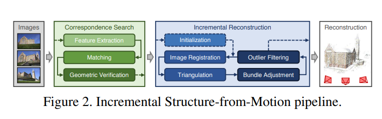

#### Correspondence Search

The first stage is correspondence search. Let $ \mathcal{I} = \left\{  I_i | i = 1 \dots N_{I}\right\}$ the set o images used for reconstruction. 
The output for this stage is a set of geometrically verified pairs of images.  In order to  compute the correspondence graph the pipeline employs:

1. **Feature extraction**: For every image $I_{i}$, the SfM detects sets of $\mathcal{F}_{i} = \left\{\left(\bold{x}_{j}, \bold{f}_{j}\right) | j = 1 \dots N_{F_{i}}\right\}$ at location $ \bold{x}_j \in \mathbb{R}^{2}$ represented by an appearance descriptor $\bold{f}_j$
2. **Feature Matching**: SfM discovers images that see the same scene part by leveraging the features $\mathcal{F}_{i}$. A naive approach would be to compare every image against every image - the complexity in this case is $O\left(N^2_{I}N^2_{F_{i}}\right)$. The output is a set of potentially overlapping image pairs $\mathcal{C} = \left\{\left\{I_{a}, I_{b}\right\} | I_{a}, I_{b} \in \mathcal{I}, a < b\right\}$ and their associated feature correspondences $\mathcal{M}_{ab} \in \mathcal{F}_{a} \times \mathcal{F}_{b}$

3. **Geometric Verification**: In this stage the SfM verifies the potentially overlapping image pairs $\mathcal{C}$. Because the matching relies solely on appearance, it is not guaranteed that the corresponding features actually map to the same point. The SfM pipeline verifies these matches by estimating two-view geometries. Based on the geometries, the features are filtered accordingly. The output of this stage is a scene graph - images being the nodes, the two view pairs being the edges

#### Incremental Reconstruction
The input for the reconstruction stage is the scene graph. The outputs are pose estimates $\mathcal{P} = \left\{\bold{P}_c \in \bold{SE}\left(3\right) | c = 1 \dots N_P\right\}$ for registered images and the reconstructed set of 3d points $\mathcal{X} = \left\{\bold{X}_{k} \in \mathbb{R}^{3} | k = 1 \dots N_{X}\right\}$

1. **Initialization**: SfM initializes the model with a carefully selected image pair. It is benefic for the BA to start from a dense region. Starting from a sparser location may result in bad reconstruction.

2. **Image Registration**: New images can registered to the current model by solving Perspective-n-Point ($\bold{PnP}$) problem. The $\bold{PnP}$ problem involves estimating the camera pose $\bold{P}_{c}$ and the camera intrinsics, in case of uncalibrated camera.

3. **Triangulation**: A newly registered image must observe existing scene points, and it may add new points to the set of points $\mathcal{X}$. A new scene point $\bold{X}_k$  can be added to $\mathcal{X}$ as soon as on more image, also covering the new scene but from different viewpoint, is registered.

4. **Bundle Adjustment**: Having the pose estimation and triangulation as separate procedures results in uncertainties being propagated through the scene. Bundle Adjustment helps with refining the scene (pose and the triangulated points) by minimizing a non-linear projection error: $E = \Sigma_{J} \rho_{j} \left(||\pi\left(\bold{P}_c, \bold{X}_k\right) - x_j||^2\right)$, $\pi$ being the projection function.

#### Challenges

1. The system fails to register large fraction of images
2. Broken models due to mis-registration and drift

These problems might stem from producing an incomplete scene graph or from the failure to register images due to missing or inaccurate scene structure

#### Scene Graph Augmentation

A geometric verification step

1.  Estimate fundamental matrix
2.  If at least $N_F$ are found, consider image pair verified
3.  Estimate homography matrix, $N_H$ being number of homography inliers
4.  moving camera if $\frac{N_H}{N_F} > \epsilon_{HF}$
5.  for calibrated images estimate essential matrix and its number of inliers $N_E$
6.  if $\frac{N_E}{N_F}$ then calibration is correct
7.  In case of correct calibration and $\frac{N_H}{N_F} < \epsilon_{HF}$ then decompose essential matrix
8.  triangulate inlier points from correspondences, and determine median triangulation angle $\alpha_m$
9.  Using $\alpha_m$ to distinguish between pure rotation and planar scenes

#### Next Best View Selection

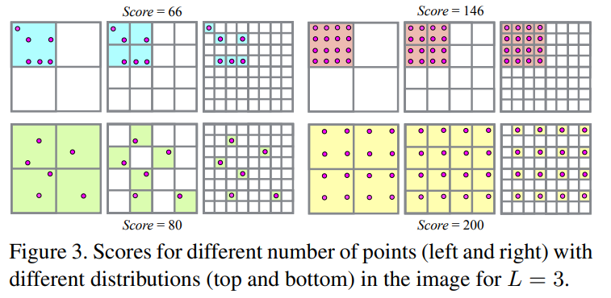

The score is based on discretizing the image into $K^{2}_l$ grid. If the 
matches keypoints are uniformly distributed, the score increases.
The score is accumulated over multiple levels with a resolution dependent wights $w_{l} = K^{2}_{l}$

#### Robust and Efficient Triangulation
> Especially for sparsely matched image collections, exploiting transitive correspondences boosts triangulation completeness and accuracy, and hence improves subsequent image registrations

> It is necessary to find a consensus set of track elements before performing a refinement using multiple views.

To handle different levels of outliers the problem is formulated as a triangulation using RANSAC
Let $\mathcal{T} = \left\{T_{n} | n = 1 \dots N_{T}\right\}$ be the features tracks with a priori unknown ratio $\epsilon$ of inliers
A measure $T_{n}$ consists of normalized image observation $\overline{\bold{x}}_{n} \in \mathbb{R}^2$  and the corresponding camera pose $\bold{P}_{n} \in \bold{SE}\left(3\right)$ defining the projection from world to camera frame $\left[R^{T} -R^{T}t\right]$ with $R \in SO\left(3\right)$ and $t \in \mathbb{R}^3$

The objective is to maximize the support of measurements conforming with well-conditioned two-view triangulation
$$X_{ab} \sim \tau\left(\overline{x}_a, \overline{x}_b, P_A, P_b\right) \text{ with } a \not= b$$
where $\tau$ is any chosen triangulation method and $X_{ab}$ is the triangulated point.

Panoramic image pairs are not used for triangulation. A well-conditioned model satisfies two constrains. 

First, a sufficient triangulation angle $\alpha$

$$\cos\alpha = \frac{t_a - X_{ab}}{||t_a - X_{ab}||_2} \frac{t_b - X_{ab}}{||t_b - X{ab}||_2}$$

Second, positive depths $d_a$ and $d_b$ w.r.t. the views $P_a$ and $P_b$, with the depth being defined as $d = \left[p_{31} \space p_{32} \space p_{33} \space p_{34}\right] \left[X^T_{ab} \space 1\right]^T$. A measurement $T_n$ is considered to conform with the moel if it has positive $d_n$ and if its reprojection error 
$$r_n = \left\Vert \overline{x}_n - \left[\begin{matrix}
    \frac{x^{'}}{z^{'}} \\
    \frac{y^{'}}{z^{'}} \\
\end{matrix}\right]\right\Vert_2 \text{ with } 
\left[\begin{matrix}
    x^{'} \\
    y^{'} \\
    z^{'} \\
\end{matrix}\right] = P_n 
\left[\begin{matrix}
    X_{ab} \\
    1
\end{matrix} \right]
 $$ 
 is smaller than a certain threshold $t$

 > RANSAC maximizes K as an iterative approach and generally it uniformly samples the minimal set of size two at random. However, since it is likely to sample the same minimal set multiple times for small NT , we define our random sampler to only generate unique samples. To ensure with confidence η that at least one outlier-free minimal set has been sampled, RANSAC must run for at least K iterations. Since the a priori inlier ratio is unknown, we set it to a small initial value ǫ0 and adapt K whenever we find a larger consensus set (adaptive stopping criterion). Because a feature track may contain multiple independent points, we run this procedure recursively by removing the consensus set from the remaining measurements. The recursion stops if the size of the latest consensus set is smaller than three. The evaluations in Sec. 5 demonstrate increased triangulation completeness at reduced computational cost for the proposed method.

#### Bundle adjustment

* **Parametrization**: There is no need to perform global bundle adjustment after each step, since incremental BA only affects the model locally. So BA is locally performed for most connected components after each image registration 
* **Filtering**: After Ba, some observation do no conform with the model. The observation with large reprojection are filtered. Also, for each point a minimum triangulation angle is enforced. the intrinsic parameters are optimized using BA, excluding principal point - it is an ill posed problem. Cameras with abnormal field of view or a large distortion coefficient magnitude are considered incorrectly estimated and filtered after global **BA**
* **Retriangulation**: pre-BA re-triangulation nad post-BA re-triangulation. the purpose of this step is to improve the completeness of the reconstruction by continuing the track of points that previously failed to triangulate - due to inaccurate poses
* **Iterative Refinement**: Since BA is severely affected by outliers, a second step of BA can significantly improve the results

#### Redundant View Mining
1. efficient camera grouping
2. partition the scene into small, highly overlapping camera groups

BA naturally optimizes mor for the newly extended parts while other parts only improve in case of drift. The unaffected scene parts are grouped as $\mathcal{G} = \left\{G_r | r = 1 \dots N_G\right\}$ - highly overlapping images and each group $G_r$ is counted as a single camera

A image is affected it is newly added or if more than a ration $\epsilon_r$ of its observations have a re-projection error larger than r pixels
> the number of co-visible points between images
is a measure to describe their degree of mutual interaction

For a scene with $N_X$ points, each image can be described by a binar visibility vector $\bold{v}_i \in \left\{0, 1\right\}^{N_X}$, where the $n$-th entry in $\bold{b}_i$ is 1 if point $X_n$ is visible in image i nad 0 otherwise. The degree of interaction between image a and b in calculated using bitwise intersection over union in their vectors $\bold{v}_i$:

$$ V_{ab} = \left\Vert\bold{v}_a \land \bold{v}_b\right\Vert\left / \Vert\bold{v}_a  \lor \bold{v}_b\right\Vert$$

The groups are built as follows:

the images are sorted as $\overline{\mathcal{I}} = \left\{I_i| \left\Vert v_i\right\Vert > \left\Vert v_{i+1}\right\Vert\right\}$
The group is initialized by removing the first image $I_a$  from $\overline{\mathcal{I}}$ and finding the image $I_b$ that maximizes $V_{ab}$

If $V_{ab} > V$ and $\left\vert G_r \right\vert < S$, the image $I_b$ is removed from $\overline{\mathcal{I}}$ and added to group $G_r$

Each image within a group is then parameterized w.r.t a common group-local coordinate frame. the BA cost function for grouped images is

$$E_g = \Sigma_j \rho_j\left(\left\Vert\pi_g\left(G_r, P_c, X_k\right) - x_j\right\Vert_2^2\right)$$ 

extrinsic group parameters $G_r \in SE\left(3\right)$ and fixed $P_c$. The projection matrix of a image in a group is defined as $P_{cr} = P_cG_r$. The overall cost $\overline{E}$ is the sum of the grouped and ungrouped cost contributions

### Experiments

1. **Next Best View Selection**: _"while all strategies converge to the same set of registered images, our method produces the most accurate reconstruction by choosing a better registration order for the images."_
2. **Robust and Efficient Triangulation**: _"Our proposed recursive approaches recover significantly longer tracks and overall more track elements than their non-recursive counterparts"_
3. **Redundant View Mining**: _"The reconstruction quality is comparable for all choices of V > 0.3 and increasingly degrades for a smaller V"_

## [Building Rome in a Day](https://grail.cs.washington.edu/rome/rome_paper.pdf)

Build distributed SfM that reconstruct using internet images

### System Design

#### Preprocessing and feature extraction
The images are available on a central store, from which they are distributed to the cluster nodes on demand. 
1. Verify for EXIF tag
2. Downsample images
3. Extract SIFT features for each image

#### Image Matching

1. Use Ann for matching SIFT features
2. The matches are geometrically verified using RANSAC-based estimation of essential or fundamental matrix.
3. Use object retrieval in order to generate proposals.
   1. vocabulary based
   2. query expansion

##### Vocabulary Tree Proposals
1. Represent image as bag of words
2. Use hierarchical k-means tree to quantize the feature descriptors
3. obtain document frequency and term frequency
##### Verification and detailed matching
1.  > We initially tried to optimize network transfers before any verification is done. In this setup, once the master node has all the image pairs that need to be verified, it builds a graph connecting image pairs which share an image
2.  > The second idea we tried was to over-partition the graph into small pieces, and to parcel them out to the cluster nodes on demand. When a node requests another chunk of work, the piece with the fewest network transfers is assigned to it.
3.  > The approach that gave the best results was to use a simple greedy bin-packing algorithm
    * The master node maintains a list of images of each node
    * When a node asks for work, the master node looks through the image pairs, and adds them if they don't require network transfer
    * A simple solution is to consider only a subset of jobs at a time

##### Merging Connected Components
Let _match graph_ be the graph where the nodes are the images, and the edges being the verified two view geometry. There are two levels of proposals $k_1$ and $k_2$. $k_2$ proposals are used to connect different connected components. The images which do not match any of their $k_1$ proposal, they are discarded.

##### Query Expansion
Using a image as query, instead of retrieving only a document (image) from the db, using query expansion, also the topological neighborhood of that result is retrieved
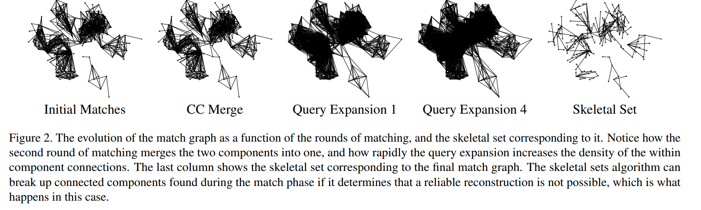

## [Discrete-Continuous Optimization for Large-Scale Structure from Motion](https://www.cs.cornell.edu/~snavely/publications/disco_cvpr11.pdf)
## [Global Structure-from-Motion by Similarity Averaging](https://openaccess.thecvf.com/content_iccv_2015/papers/Cui_Global_Structure-From-Motion_by_ICCV_2015_paper.pdf)
## [ Robust global translations with 1dsfm](https://www.cs.cornell.edu/projects/1dsfm/docs/1DSfM_ECCV14.pdf)
## [HSfM: Hybrid Structure-from-Motion](https://openaccess.thecvf.com/content_cvpr_2017/papers/Cui_HSfM_Hybrid_Structure-from-Motion_CVPR_2017_paper.pdf)

## [Learning a Multi-View Stereo Machine](https://arxiv.org/pdf/1708.05375)
## [DEEPV2D: VIDEO TO DEPTH WITH DIFFERENTIABLE STRUCTURE FROM MOTION](https://arxiv.org/pdf/1812.04605)
## [BA-NET: DENSE BUNDLE ADJUSTMENT NETWORKS](https://arxiv.org/pdf/1806.04807)
## [Multi-Scale Geometric Consistency Guided Multi-View Stereo](https://arxiv.org/pdf/1904.08103)

## [DeepSFM: Structure From Motion Via Deep Bundle Adjustment](https://arxiv.org/pdf/1912.09697)
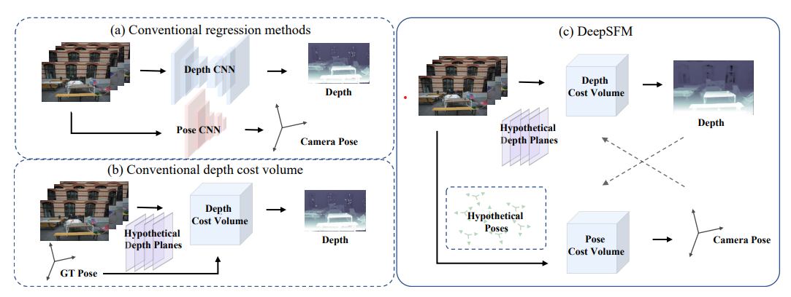

> Our method does not require accurate pose, and a rough estimation is enough.
> our network includes a depth based cost volume (D-CV) and a pose based cost volume (P-CV).
> we also assume initial structures (i.e depth maps) and motions (i.e. camera poses) are given

### Workflow
#### 2d Feature Extraction
#### Depth based Cost Volume (D-CV)
> Inspired by the traditional plane sweep cost volumes, our D-CV is a concatenation of three components: the target image features, the warped source image features and the homogeneous depth consistency maps
#### Pose based Cost Volume (P-CV)
> Similar to D-CV, P-CV is also concatenated by three components: the target image features, the warped source image features and the homogeneous depth consistency maps.
>  For rotation, we sample δR uniformly in the Euler angle space in a predefined range and multiply δR by the initial R. For translation, we sample δt uniformly and add δt to the initial t. In the end, a group of P virtual camera poses noted as {R ∗ ip|t ∗ ip} P p=1 around input pose are obtained for cost volume construction.
#### Cost Aggregation and Regression
#### Training
> The DeepSFM learns the feature extractor, 3D convolution, and the regression layers in a supervised way

## [FlowMap: High-Quality Camera Poses, Intrinsics, and Depth via Gradient Descent](https://arxiv.org/pdf/2404.15259)
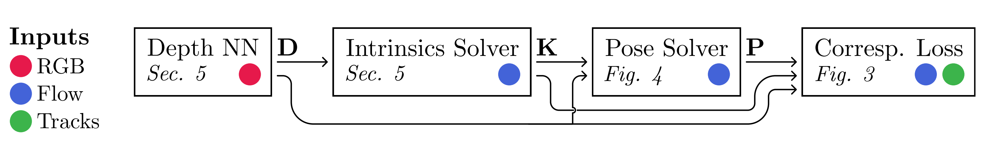
### Supervision via Camera-Induced Scene Flow
1. Unproject pixels $\bold{u}_i \in \mathbb{R}^2$ from image $I_{i}$ using depth map $D_{i}$ and intrinsic matrix $K_{i}^{-1}$, yielding a 3D point $x_{i}$
2. Use relative camera pose $P{ij}$ between frames $i$ and $j$ to transform a point $x_{i}$ onto $x_{j}$, yielding an image an implied $\hat{\bold{u}}_{ij}$.
3. Compare the computed correspondence $\hat{\bold{u}}_{ij}$ with a know correspondence $\bold{u}_{ij}$
$$\mathcal{L} = ||\hat{\bold{u}}_{ij} - \bold{u}_{ij}||$$
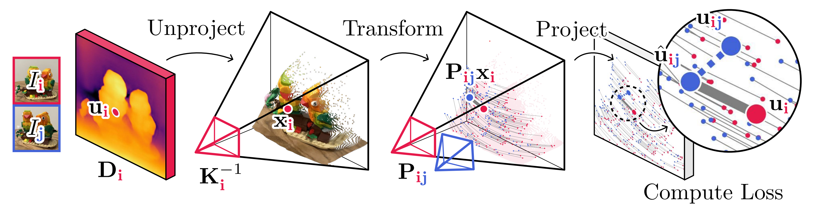
#### Supervision via Dense Optical Flow and Sparse Point Tracks
> Use off-the-shelf point tracker
1. Correspondences derived from two sources: frame by frame optical flow and sparse tracks.
2. Correspondences flow optical flow $\bold{F}_{i}$: $\bold{u}_{ij} = \bold{u}_{i} + \bold{F}_{ij}\left[\bold{u}_{i}\right]$.

### Parameterizing Depth, Pose, and Camera Intrinsics
#### Depth Network.
Use a pre-trained network that estimates depth
#### Pose as a Function of Depth, Intrinsics and Optical Flow
1. Unproject the pixels to create point clouds: $\bold{X}_{j}^{\leftrightarrow}$, $\bold{X}_{i}^{\leftrightarrow}$
2. Use Procrustes formulation to solve the alignment. Use the flow correspondences

$$\bold{P}_{ij} = \text{arg min}_{\bold{P \in SE\left(3\right)}} || \mathcal{W}^{\frac{1}{2}}\left(\bold{X}_{j}^{\leftrightarrow} - \bold{P}\bold{X}_{i}^{{\leftrightarrow}}\right)||$$
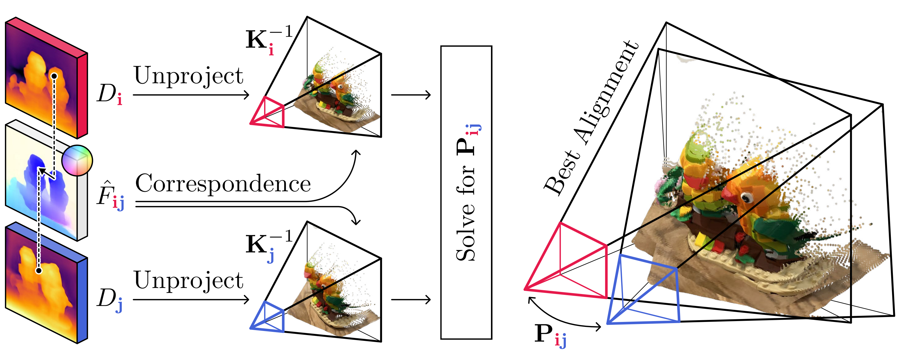

#### Camera Focal Length as a Function of Depth and Optical Flow.
1. Use multiple candidates $\bold{K}_{k}$
2. Softly select among the 
3. Compute the resulting intrinsics as $\bold{K} = \sum_{k} \omega_{k} \bold{K}_{k}$, $\omega_{k} = \frac{e^{-\mathcal{L}_k}}{\sum_{l}e^{-\mathcal{L}_l}}$

## [DUSt3R: Geometric 3D Vision Made Easy](https://arxiv.org/pdf/2312.14132)
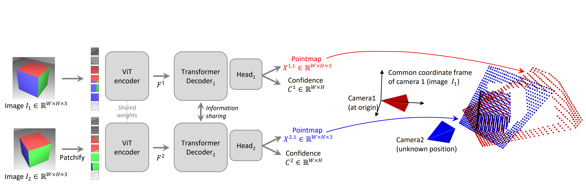

Let $\bold{X} \in \mathbb{R}^{\bold{W} \times \bold{H} \times 3}$ be a dense $\bold{2D}$ field of $\bold{3D}$ points. In association with its corresponding $\bold{RGB}$ image $I$ of resolution $W \times H$, $X$ forms one-to-one mapping between image pixels and 3D scene points $I_{i, j} \leftrightarrow X_{i, j}$, for all pixel coordinates $\left(i, j\right) \in \left\{1\ldots W \right\}\times\left\{1 \ldots H\right\}$
Given camera intrinsics $K \in \mathbb{R} ^{3 \times 3}$, the pointman  $X$ of the observed scene can be obtained using the depthmap $D \in \mathbb{R}^{W \times H}$ as follows: $X_{ij} = K^{-1}\left[iD_{i, j}, jD_{i, j}, D_{i, j}\right]$. Let $X^{n,m}$ be the pointmap $X^{n}$ of image $n$ in camera m's coordinate frame:
$$X^{n,m} = P_M \cdot P_n^{-1}h\left(X^n\right)$$
with $P_m, P_n \in \mathbb{R}^{3 \times 4}$ world-to-camera poses for images $m$ and $m$, and $h: \left(x, y, z\right) \rightarrow \left(x, y, z, 1\right)$

>To that aim, we train a network F that takes as input 2 RGB images $I_1,I_2 \in \mathbb{R}^{W \times H \times 3}$ and outputs 2 corresponding pointmaps $X^{1,1} , X^{2,1} \in \mathbb{R}^{W \times H \times 3}$ with associated confidence maps $C^{1,1}, C^{2,1} \in \mathbb{R}^{W \times H}$
### Network architecture.

> inspired by CroCo pretraining

> Hence, pointmaps do not necessarily correspond to any physically plausible camera model.  Rather, we let the network learn all relevant priors present from the train set, which only contains geometrically consistent pointmaps. Using a generic architecture allows to leverage strong pretraining technique, ultimately surpassing what existing task-specific architectures can achieve. We detail the learning process in the next sect

#### Training Objective
* 3D Regression Loss between GT depthmaps and learned depthmaps
* Confidence Loss

### Downstream Applications
1. Point Matching
2. Recovering Intrinsics
3. Relative Pose Estimation
4. Absolute Pose Estimation

### Global Alignment
1. construct pair-wise scene graph $\mathcal{G} \left(\mathcal{V}, \mathcal{E}\right)$
> Discussion. We point out that, contrary to traditional bundle adjustment, this global optimization is fast and simple to perform in practice. Indeed, we are not minimizing 2D reprojection errors, as bundle adjustment normally does, but 3D projection errors. The optimization is carried out using standard gradient descent and typically converges after a few hundred steps, requiring mere seconds on a standard GPU

## [Grounding Image Matching in 3D with MASt3R](https://arxiv.org/pdf/2406.09756)

* Similar to Dust3R, but it doesn't normalize the depth maps
* In addition to DUSt3R, MASt3R adds a new matching head that outputs two dense feature maps $D^1 \text{ and } D^2 \in \mathbb{Rj}^{H \times W \times d}$
  * $$D^{1} = \text{Head}^{1}_{desc}\left(\left[H^1, H^{`1}\right]\right) \\ D^{2} = \text{Head}^{2}_{desc}\left(\left[H^2, H^{`2}\right]\right)$$

    * Where $$H^{1} = \text{Encoder}\left(I^1\right) \\ H^{2} = \text{Encoder}\left(I^2\right)$$
    * 
> Matching objective. We wish to encourage each local descriptor from one image to match with at most a single descriptor from the other image that represents the same 3D point in the scene.
> Note that this matching objective is essentially a cross-entropy classification loss: contrary to regression in eq. (6), the network is only rewarded if it gets the correct pixel right, not a nearby pixel
### Fast reciprocal matching
* naive implementation of reciprocal matching has a high computational complexity of $O\left(W^2H^2\right)$
    > We therefore propose a faster approach based on sub-sampling.

* Coarse-to-fine matching

### Experimental results
#### Training
* **Training Data** mixture of 14 datasets
> Training. We base our model architecture on the public DUSt3R model and use the same backbone (ViTLarge encoder and ViT-Base decoder).

#### Tasks
1. Map-free localization
2. Relative pose estimation - :TODO check some notable papers in this section
3. Visual localization
4. Multiview 3D reconstruction
### Architecture
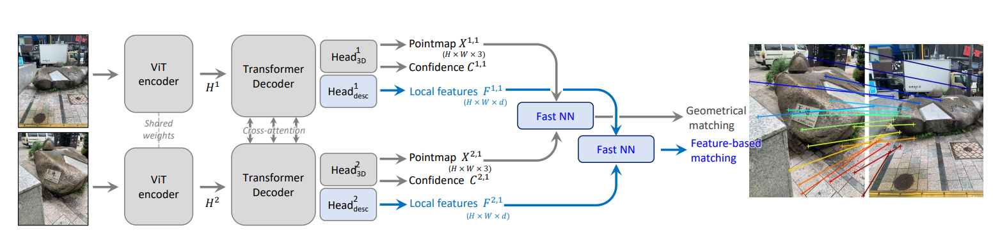

## [MASt3R-SfM: a Fully-Integrated Solution for Unconstrained Structure-from-Motion](https://arxiv.org/pdf/2409.19152)
* **Good overview of the current approaches to Structure from Motion**
* > Thanks to the robustness of MASt3R to outliers, the proposed method is able to completely get rid of RANSAC

* > it works even when there is no motion

### Contributions
1. full-fledged Sfm pipeline able to process unconstrained image collections
2. Exploit the encoder from [MASt3R](#grounding-image-matching-in-3d-with-mast3r) to perform large-scale image retrieval
3. The entire SfM pipeline is training-free, provided off-the-self MASt3R checkpoint.

#### Image Retrieval for SfM
* performed in steps - one global, one local
### Approach
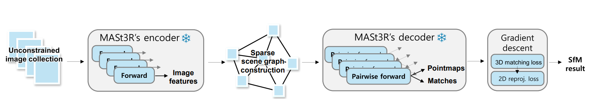

#### Scene Graph
1. Sparse scene graph
   * $\mathcal{G} = \left(\mathcal{V}, \mathcal{E}\right)$ is a graph where each vertex $I \in \mathcal{V}$ is an image, and each edge $e=\left(n, m\right) \in \mathcal{E}$ is an undirected connection between two overlapping images $I^n$ and $I^m$
2. Image Retrieval
   * $h\left(I^n, I^m\right) \rightarrow s$, where $s \in \left[0, 1\right]$ is a co-visibility score between two images $I^n$ and $I^m$. MASt3R's encoder is used for this task. 
     * ASMK (Aggregated Selective Match Kernels)
3. Graph construction
   * select fixed number of $N_a$ images (keyframes) using farthest point sampling base on similarity matrix $S$.
#### Local Reconstruction
1. **Canonical pointmaps**
    * Let $\mathcal{E}^n = \left\lbrace e \vert e \in \mathcal{E}  \wedge n \in e\right\rbrace$ be the set of all edges connected to image $I^n$. For each edge $e \in \mathcal{E}^n$ there is a different estimate of $X^{n, n}$ and its respective confidence maps $C^{n,n}$, denoted as $X^{n, e} \text{ and } C^{n, e}$. The canonical pointmap is computes as:
      * $$\tilde{X}^{n}_{i, j} = \frac{\sum_{e \in \mathcal{E}^{n}}C^{n, e}_{i, j}X^{x, e}_{i, j}}{\sum_{e \in \mathcal{E}^n}C^{n,e}_{i, j}}$$
      * From it, the canonical depthmap and the focal length can be recovered using Weiszfeld algorithm

2. Constrained pointmaps
The 3D point $\chi^{n}_{i, j}$ seen at pixel $\left(i, j\right)$ of image $I^n$ is defined using inverse reprojection as $\chi^n_{i, j} = \pi^{-1}_n\left(\sigma_n, , K_n, P_n, Z^{n}_{i, j}\right) = \frac{1}{\sigma_n} P^{-1}_n \cdot K^{-1}_{n} \cdot Z^{n}_{i,j} \left[i, j, q\right]^{T}$ 
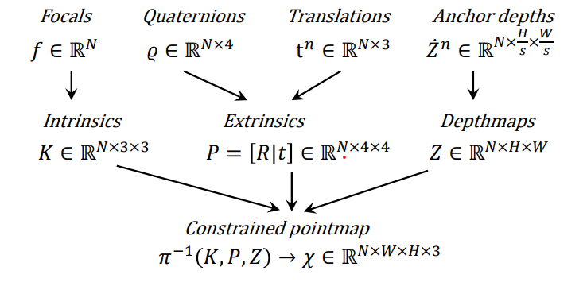

3. Coarse alignment
find $\sigma^{*}, P^{*}$ for every canonical pointmap $\chi$ such that any pair of matching 3D points gets as close as possible
$$\sigma^*, P^*=\underset{\sigma, P}{\text{argmin}}\underset{c \in \mathcal{M}^{m, n}, \left(n, m\right) \in \mathcal{E}}{\sum} q_c \left\Vert \chi ^{n}_c - \chi^{m}_c\right\Vert^{\lambda_1}$$
4. Refinement 
Because there are depth ambiguities a second round of global optimization -similar to bundle adjustment - is applied
  * We propose instead to form pseudo-tracks by creating anchor points and rigidly tying together every pixel with their closest anchor point
## [Pixel-Perfect Structure-from-Motion with Featuremetric Refinement](https://arxiv.org/pdf/2108.08291.pdf)

### Background
1. global refinement
2. Track refinement - improves keypoint location

### Approach
> refining geometry is an inherently local operation, which, we show, can efficiently benefit from locally-dense pixels.
> While SfM typically discards image information as early as possible, we instead exploit it in several steps of the process thanks to direct alignment.

1. Featuremetric optimization
    * Direct alignment
      * Flow estimation
        * > It naturally emerges from the direct optimization of the photometric error
        * the flow can be made consistent across multiple views by jointly optimizing the cost over all pairs of observations
    * Learned representation
      * the CNN features exhibit high invariance to illumination, etc.
      * the same representation for keypoints and bundle adjustments
2. Keypoint adjustment
    * Track separation
      * a 3D point has a single projection on a given image plane, valid tracks cannot contain multiple keypoints detected in the same image
      * use this property to prune most incorrect matches
    * Objective
      * adjust the locations of 2D keypoints belonging to the same track $j$ by optimizing its featurementric consistency: $E^{j}_{\text{FKA}} = \underset{\left(u, v\right) \in \mathcal{M}\left(j\right)}{\sum} w_{uv} \left\Vert F_{i}\left(u\right)\left[p_u\right] - F_{i}\left(v\right)\left[p_v\right]\right\Vert_{\gamma}$, where $w_{uv}$ is the confidence of the correspondence $\left(u, v\right)$
    * Efficiency
    * Drift
      * Due to the lack of geometric constrains the keypoints are allowed to drift everywhere
      * It is crucial to limit drift
      * For each track, the keypoints with the highest connectivity is frozen
3. Bundle adjustment
   * applied per tracks

#### Implementation
1. Dense extractor - S2DNet
2. Optimization - the optimization problems of keypoints and bundle adjustments are solved using LM from Ceres. The keypoints are allowed to move at most K = 8 pixels. Feature lookup is implemented using bicubic interpolation
    > To improve the convergence, we store and optimize its spatial derivatives

#### Tasks
1. 3D triangulation
2. Camera pose estimation
3. End-to-end SfM
## [Detector-Free Structure from Motion](https://zju3dv.github.io/DetectorFreeSfM/files/main_cvpr.pdf)
> To solve the inconsistency issue of detector-free matching, our SfM framework reconstructs the scene in a coarse-tofine manner, which first builds a coarse SfM model with the quantized matches, and then iteratively refines the model towards higher accuracy

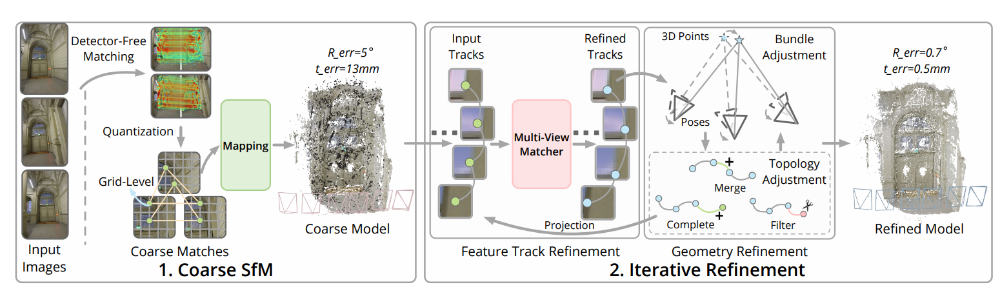
### Related Work
1. Structure from Motion

  > The framework eliminates the requirement of sparse feature detection at the beginning of the the pipeline, which makes it more robust for low texture scenarios
2. Feature Matching
3. Multi-View Refinement
  > The technical challenge is that perview detection of feature points cannot guarantee their geometric consistency among multiple views.

### Method
Let $\left\lbrace I_i\right\rbrace$, the objective is to recover camera poses $\left\lbrace\xi_i \in \mathbb{SE}\left(3\right)\right\rbrace$, intrinsic parameters $\left\lbrace C_i\right\rbrace$ and the scene point cloud $\left\lbrace P_j\right\rbrace$. The approach use two two stage pipeline:
1. establish correspondences between image pairs using detector-free matcher and reconstruct an initial coarse SfM
2. Perform an iterative refinement to improve accuracy

#### Detector-Free Matching and Coarse SfM
First, there is a detector-free semi-dense feature matching between image pairs instead of first detecting sparse keypoints as in the traditional SfM pipeline.

* Match Quantization
  * discretize the dense features locations into a fixed grid: $\lfloor\frac{x}{r}\rceil \ast r$. This forces multiple keypoints to merge into a single keypoint.
* After the quantization, utilize the matches to obtain a coarse SfM model
> The accuracy of recovered camera poses and point clouds is limited due to match quantization, which serves as the initialization of our refinement framework introduced in the next section.

#### Iterative SfM Refinement
* first enhance the accuracy of the feature tracks
* the refined feature tracks are then fed into a geometry refinement phase, which optimizes camera poses and point clouds jointly
  > The refinement process can be performed multiple times for higher accuracy.

1. Feature Track Refinement
   * a feature track $ \mathcal{T}_j = \left\lbrace x_k \in \mathbb{R}^{2} \vert k = 1 \colon N_j\right\rbrace$ is a set of 2d keypoints locations in multi-view images corresponding to a 3D scene point $P_j$
     1. extract a feature at the keypoint in the reference view
     2. extract a grid of $p \times p$  of features withing every other views in the track
     3. correlate the feature in the reference view with every other grid of features, at the end yielding a $N_j -1$  heatmaps of $p \times p$. This gives a candidate feature track with refined keypoint locations in all query views as well the uncertainty of this candidate track (the sum of variance over all the heatmaps)
     4. To refine the location of the keypoint in the reference view, a $ w \times w$ grid is samples around the original keypoint. Then for every feature in the grid the same refinement is applied, the track with the smallest uncertainty is selected $\mathcal{T}_j^{*}$
   * Reference view selection
     * The view with the scale closest to the medium scale across the track is selected as the reference view, the others are used as query views 
   * Multi-view Feature Transformer

  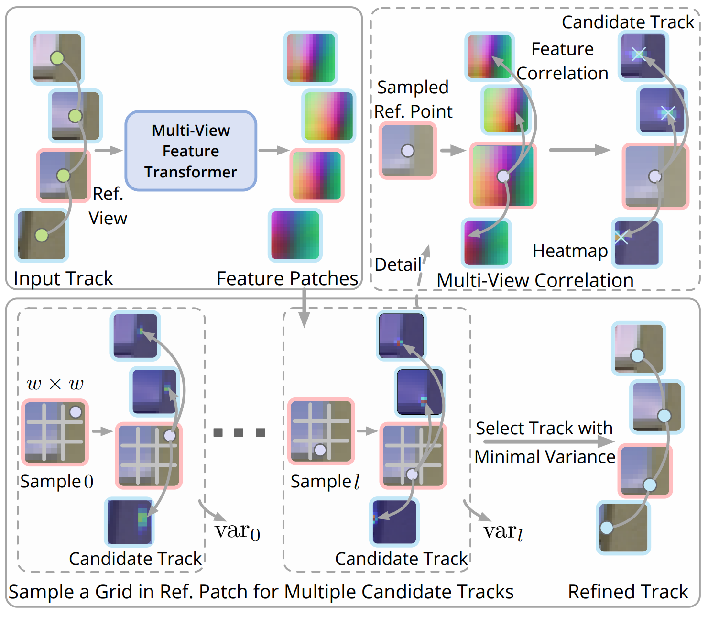

2. Training 
   * The only module trained is the multi-view feature transformer
     * it is train on MegaDepth using $\mathcal{l}_2$ loss at keypoint locations between the refined tracks and the ground-truth tracks
  * training data 
    * sampling image bags in each scene with a maximum of six images in each bag
    * the image bags are sampled based on covisibility  provided scene SfM model.
    * the gt feature tracks in each bag are built by randomly selecting a reference image and projecting its grid points to other views by depth maps

#### Geometry Refinement
Base on previously refined feature tracks $\left\lbrace\mathcal{T}^{*}_{j}\right\rbrace$, the geometry refinement pipeline iteratively refines the poses, intrinsics, point clouds, as well as the topology of the feature tracks

* perform BA to optimize poses and points clouds based on the refined feature tracks.
* After BA, a topology adjustment (TA) is performed, which benefits further BA and multi-view matching
  * Adjust the topology by
    * adding 2D keypoint tracks that previously failed to be registered into feature tracks
    * merge tracks that can meet the reprojection criteria
    * outlier filtering

## [Scene Coordinate Reconstruction: Posing of Image Collections via Incremental Learning of a Relocalizer](https://arxiv.org/pdf/2404.14351)
## [Visual Geometry Grounded Deep Structure From Motion](https://arxiv.org/pdf/2312.04563)
### TLDR
1. Supervised all trainable structure from motion
2. differentiable BA

### Architecture
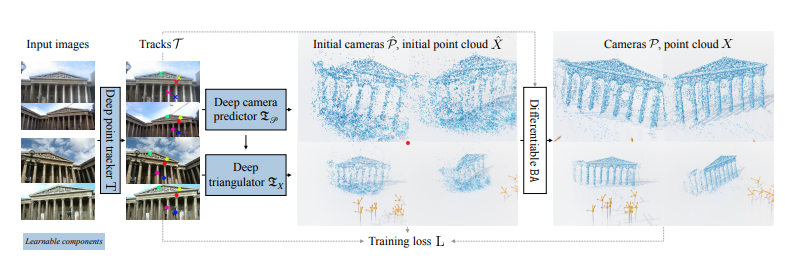
### Method
> VGGSfM implements SfM via single function $f_{\theta}$

* It accepts a set of images and it outputs the camera parameters $\mathcal{P}$ and the scene point cloud $X$
* Every part of the pipeline is differentiable, making it learnable end-to-end
  1. tracker
  2. initial camera parameters
  3. initial point cloud
  4. bundle adjustment

#### Tracking
* uses a deep feed forward tracking function
* input a set of images, the output a set of reliable point trajectories across all images
* Architecture
  * let $N_T$ query points in a frame $I_i$
  * sample CNN base descriptors for every query point
  * correlate the query points across all $N_I$ images at different spatial resolution - using the cost volume ofc
  * flatten into tokens $V \in \mathbb{R}^{N_T \times N_I \times C}$, where the total numer of elements in the cost-volume pyramid
  * Feed the tokens to a transformer, obtaining the tracks $\mathcal{T} = \left\lbrace T^j\right\rbrace_{j=1}^{N_T}$

  > our tracker does not assume temporal continuity. Therefore, we avoid the sliding window approach and, instead, attend to all the input frames together.
* Tracking confidence
  * the tracker estimates the confidence for each track-point
  * model predicts the variance $\sigma^j_i $ of the track
  * the confidence is its inverse $\frac{1}{\sigma_i^j}$
* Coarse-to-fine tracking
  > As described above, we first coarsely track image points using feature maps that fully cover the input images I. Then, we form $P \times P$ patches by cropping input images around the coarse point estimates and execute the tracking again to obtain a sub-pixel estimate.

#### Learnable camera & point initialization
> Importantly, we register all cameras and reconstruct all scene points collectively in a non-incremental differentiable fashion.
1. Learnable camera
   * initial 8 point algorithm for pose estimation
   * concatenates the poses with token computed by cross attention
   * It results in initial poses $\hat{\mathcal{P}}$
2. Learnable points
  > The preliminary point cloud is formed via closed-form multi-view Direct Linear Transform (DLT) 3D triangulation
   * uses the initial poses $\hat{\mathcal{P}}$
   * uses a transformer as a triangulator

#### Bundle Adjustment
> Additionally, the error terms are filtered out if the corresponding points have low visibility, low confidence, or do not fit the geometric constraints defined by [SfM revisited](#structure-from-motion-revisited)
* Differentiable Levenberg-Marquardt
  * Theseus library 

#### Camera parameterization
8-degrees of freedom
1. the rotation quaternion $q\left(R\right) \in \mathbb{R}^4$ of rotation $R \in \mathbb{SO}\left(3\right)$
2. the translation $t \in \mathbb(R)^3$
3. the logarithm of focal length $ln\left(f\right) \in \mathbb{R}$, $f \in \mathbb{R}^{+}$

#### Training loss 
1. loss between ground truth $3D$ points and the initial and BA-refined 3D points - Huber loss
2. loss between ground truth pose points and the initial and BA-refined pose - Huber loss
3. likelihood of a ground-truth track point 

  

## [Generalized Differentiable RANSAC](https://arxiv.org/pdf/2212.13185)

## [FASTMAP: Revisiting Dense and Scalable Structure from Motion](https://arxiv.org/pdf/2505.04612v1)
## [RoMo: Robust Motion Segmentation Improves Structure from Motion](https://arxiv.org/pdf/2411.18650v1)
## [DiffPoseNet: Direct Differentiable Camera Pose Estimation](https://openaccess.thecvf.com/content/CVPR2022/papers/Parameshwara_DiffPoseNet_Direct_Differentiable_Camera_Pose_Estimation_CVPR_2022_paper.pdf)
## [SfM-Net: Learning of Structure and Motion from Video](https://arxiv.org/pdf/1704.07804)

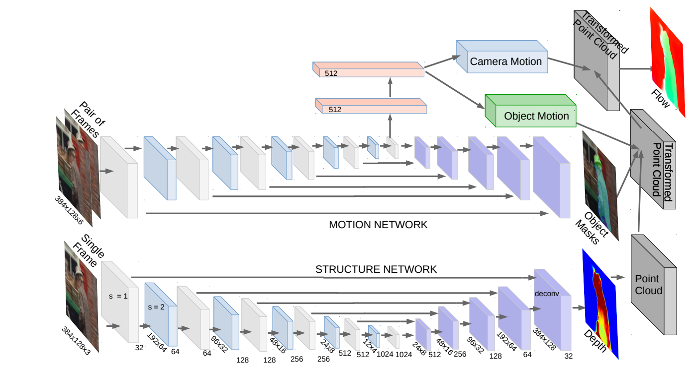
## [RelPose: Predicting Probabilistic Relative Rotation for Single Objects in the Wild](https://arxiv.org/pdf/2208.05963)
## [Unsupervised Learning of Depth and Ego-Motion from Vide](https://arxiv.org/pdf/1704.07813)

## [Multi-View Optimization of Local Feature Geometry ](https://arxiv.org/pdf/2003.08348)

## [Semantic Texture for Robust Dense Tracking](https://arxiv.org/pdf/1708.08844)

## [An Iterative Image Registration Technique with an Application to Stereo Vision](https://www.ri.cmu.edu/pub_files/pub3/lucas_bruce_d_1981_1/lucas_bruce_d_1981_1.pdf)

## [NEURAL OUTLIER REJECTION FOR SELF-SUPERVISED KEYPOINT LEARNING](https://arxiv.org/pdf/1912.10615)

## [CAP-Net: A Unified Network for 6D Pose and Size Estimation of Categorical Articulated Parts from a Single RGB-D Image](https://arxiv.org/pdf/2504.11230v2)

## [Back to the Feature: Learning Robust Camera Localization from Pixels to Pose](https://arxiv.org/pdf/2103.09213)